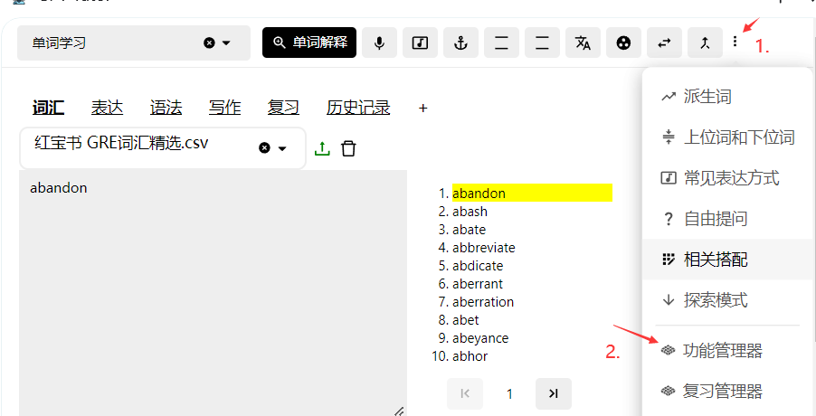
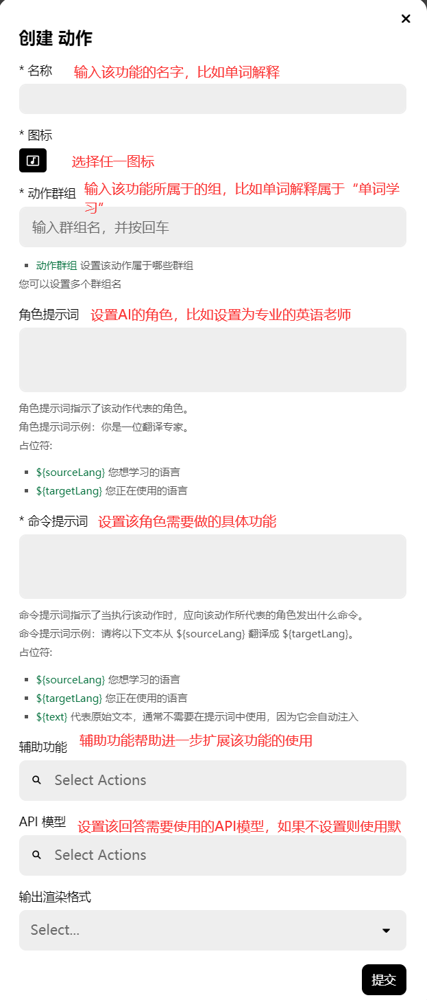

### 功能管理器

在功能管理器中存储和定义了一切你使用的功能，比如“单词解释”，“修改语法错误”，你可以在这里添加新的功能，或者删除、更新原来的功能。还可以整个导入或导出所有功能。

#### 如何打开

#### 如何创建新的功能

1. 打开功能管理器

2. 点击创建。

3. 输入相关信息。

#### 如何更新或删除原来的功能

1. 打开功能管理

2. 找到你需要修改的功能

3. 找到后鼠标放在该功能所在的方框上，右侧会显示“更新”和“删除”两个按钮。

4. 输入相关信息。

#### 特别注意

##### 辅助功能

辅助功能起到两个作用：

1. 在使用ChatGPT（Web）时，辅助功能和当前使用的功能会使用同一个对话，这样辅助功能可以直接获取当前对话中的上下文。

2. 如果当前使用的功能需要额外的步骤来实现（比如你把一个复制任务分成了两步来实现），那么你可以在辅助功能中来实现额外的步骤。

##### API模型

提前预设该功能所要使用的model（前提是你已经在设置页面中完成相关设置）。

**不同的功能需要的model是不同的，而不同的model价格和响应速度、准确率都不同**，为了兼顾价格和使用效果，经常需要切换使用。比如单词基本含义解释只需要最简单的gpt-3.5即可（在解释基本含义时两者差别不大，但gpt-4比gpt-3.5可贵太多了），但是句子结构分析就需要使用gpt-4（分析效果会好上很多）。

你可以把那些很简单但是又需要速度的功能分配给速度最快的LLM，需要大量实现但是不要求效果特别好的功能分配给本地的LLM，然后要求效果好但是又不想花钱的功能就分配给ChatGPT Web（如果你订阅了plus，就可以直接使用GPT-4），这样既省时又省钱。