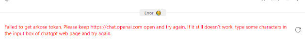

## 在使用ChatGPT(Web)时可能遇到的问题和解决方案

如果你能够正常使用ChatGPT，那么非常建议你在设置GPT-Tutor的Provider时使用ChatGPT（Web），它不仅是免费的，而且可以解锁更多功能。

在使用时你可能会遇到以下问题：

### 无法获取accessToken（如图）

#### 解决方案：

1. 点击右侧的重新获取按钮，重复三四次，一般即可获取到accessToken。

如果刷新多次都无法获取，那么你需要检查你能否正常连接到[ChatGPT](https://chatgpt.com/)，如果能连接到ChatGPT却获取不到accessToken，那么你需要这么做：

2. 删除chatgpt网页上的cookies，登出你的账号，重新登录，然后再回到GPT-Tutor的该页面尝试重新获取accessToken。

### 无法获取arkoseToken（如图）

#### 解决方案：

1. 打开[ChatGPT](https://chatgpt.com/)，然后随便输入一个问题提交，等待回答完成，之后重新打开GOT-Tutor看能否使用。

2. 如果还不能，则打开[ChatGPT](https://chatgpt.com/)，看对话记录中有没有出现如图中的New Chat，打开，点击重新生成，等待回答完成，之后重新打开GOT-Tutor。

通常情况下经过以上操作即可正常使用ChatGPT Web，如果还不行，可能是因为你的VPN或你的账号被OpenAI认为是有风险，导致无法使用。这时候建议你使用其它免费的Provider（比如Kimi和ChatGLM，但效果可能没有ChatGPT那么好），或者付费的Provider。