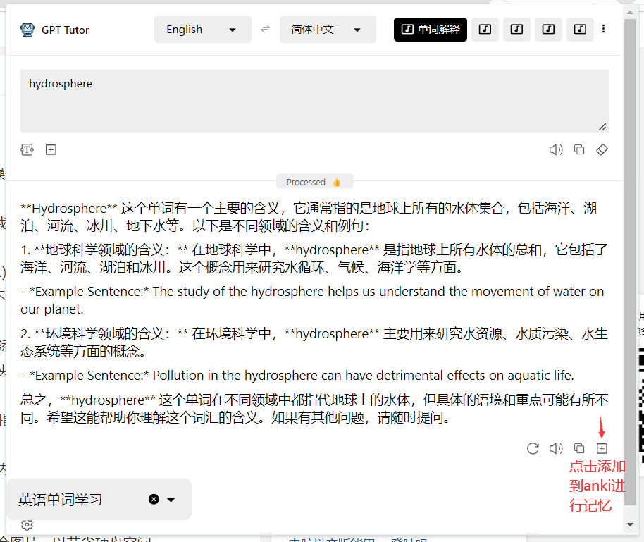
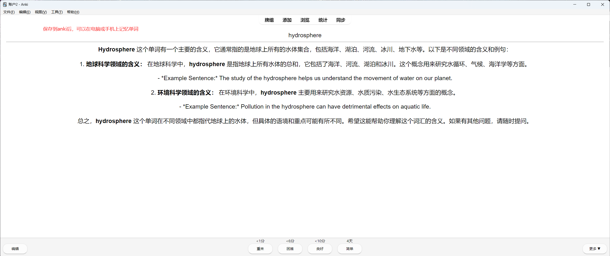
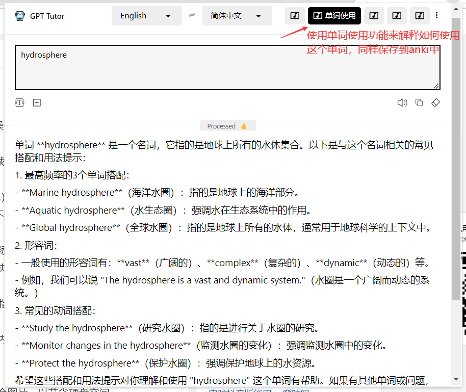
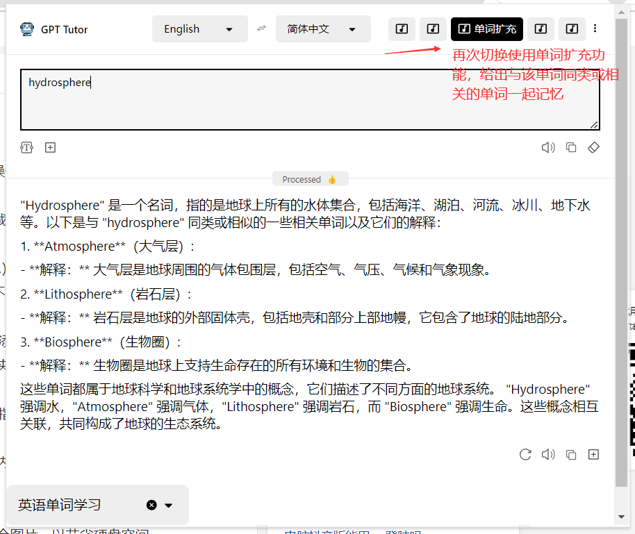

###   Day 1

打开刘洪波的IELTS雅思真经，从章节一**自然地理**第一小节的单词开始。

**第一小节 atomosphere, hydrosphere，lithosphere**

以hydrosphere为例演示整个过程。

#### 使用GPT-Tutor的功能学习单词

首先使用**单词解释**这个功能。

点击添加到anki之后

建议在添加单词时进行**第一遍记忆**，随后再添加到anki中进行重复记忆。

接下来分别使用**单词使用**和**单词扩充**的功能。

#### 复习

##### 使用Anki完成复习

如果你需要在移动端完成复习，那么你需要使用anki。

综上我们完成这一小节的第一遍学习，之后我们在anki上点击同步，这样就能把学习记录同步到手机，随时打开手机进行复习。

