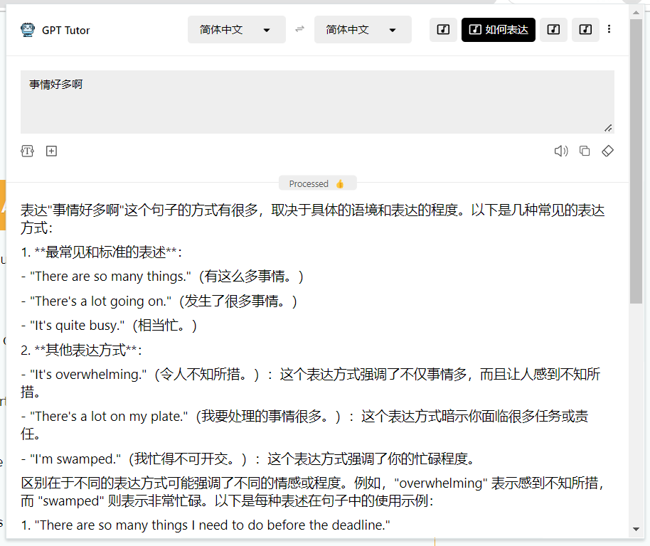

## 什么是表达学习？

表达学习是在单词基础上的进一步学习，我们学习的不再是一个独立的单词，而是一个**完整的表达**。

> 什么是表达？比如在雅思口语考试中，对口语的考察实际上取决于四个方面：发音（pronunciation）、语法（grammar）、词汇（vocabulary也）、流畅（fluency），而其中语法、词汇、流畅都可以理解为对表达的考察。许多外语学习者把太多时间和精力放在了发音上，却忽略了最重要的表达练习。实际上，无论是在日常生活中，还是在考试中，你都可以有各种各样的口音，发音不那么标准也没关系，只要做到**正确、准确**表达即可。

## GPT-Tutor如何帮助你练习表达

GPT-Tutor提供了三种练习英语表达的方法，循序渐进使用这三种方法将十分有效地提高你的英语表达能力。

### 方法一：练习基本表达

第一种方法在我之前已经提到过，找到一本记录表达英语表达（常用搭配、成语、句式等）的书籍，比如《会让你在IELTS写作与口语考试中更像一个Native Speaker的纯正英式短语英式句型1000条》，然后将里面的表达加入到anki中进行学习和记忆，通过这个方法你能够像学习单词一样学习英语表达。

当然，你要学习的表达不一定要完全按照书上的内容，你也可以随时学习和记忆你自己想要知道的表达，比如你今天工作很忙，你可能会想知道"事情好多啊"如何表达，你就可以使用“如何表达”这个功能，你输入中文它就会给出对应的英语地道表达。

表达学习可以是突然你脑海里蹦出的一句话，比如我今天事情很多，我想知道“事情好多啊”在英语中如何表达：

事情好多后我的心情是怎样呢，当然是觉得“真麻烦”，我所以我还想知道“真麻烦”是如何表达的。

骑电动车经过某个商圈的十字路口，想知道交通相关的表达，使用“表达学习”这个功能。

看杂志时看到一个表达cloak of secrecy，我不认识这个单词，于是使用“如何表达”这个功能。

### 方法二：练习基本段落表达

第二种则是方法一的进阶，当你了解的表达足够多时，你可能已经能够说出一段相对比较完整的内容了，这时候你就需要把表达再组织、扩展成一个段落，这时候你就需要用到GPT-Tutor中的“主题表达”这个功能。这个功能的作用是，你输入一个主题，比如“我最喜欢的运动是跑步”，GPT-Tutor就能够给出一段完整的表达，你可以像学习单词一样学习这段主题表达。

你可以直接通过“主题表达”这个功能来像记单词一样记忆和学习主题表达，但是我更建议你在它的基础上自己完成一段完整的内容表达，然后使用“评价和修改”这个功能来改善，然后再添加到anki中。

### 方法三：真实场景演练

第三种则是视频中演示的这种，当我们对表达和组织具体的段落都足够熟练后，我们就可以尝试在真实场景中来使用和练习我们学习到的表达，并且让ChatGPT对你的表达做出更好的修正和完善。如果你在OpenAI所支持的地区，那么你可以在手机上直接使用ChatGPT模拟更真实的口语练习。

