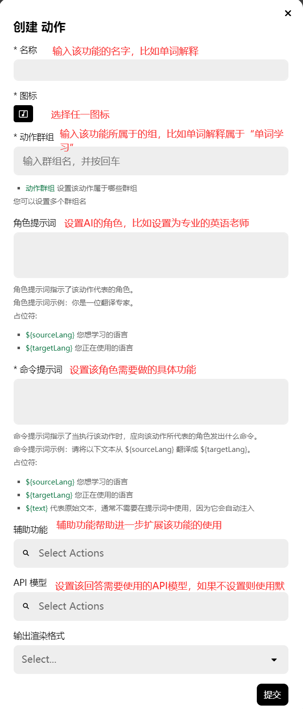

在功能管理器中存储了所有功能的设置，比如“翻译”、“单词解释”，“修改语法错误”等等，你可以在这里查看所有功能是如何实现的，创建、删除或更新功能。

一个功能通常主要由两部分组成：role prompt和command prompt。

- Role Prompt（角色提示词）：设置AI的角色，比如你可以设定为一名专业的英语老师；

- Command Prompt（命令提示词）：决定了这名老师具体需要做的事情，比如“解释以下单词的含义”。

还有其它一些重要的设置：

- 功能组（Action Group）：你可以把多个功能放在一个功能组中，比如把雅思学习相关的功能放在同一个功能组中。

- API模型（API Model）：提前预设该功能所要使用的模型（前提是你已经在设置页面中完成相关设置）。

- 输出格式（Output Format）：决定了AI的输出格式，比如你可以选择“Markdown”，“Text”等。

### 如何创建新的功能

1. 打开功能管理器

2. 点击创建。

3. 输入相关信息。

### 如何更新或删除原来的功能

1. 打开功能管理

2. 找到你需要修改的功能

3. 找到后鼠标放在该功能所在的方框上，右侧会显示“更新”和“删除”两个按钮。

4. 输入相关信息。

