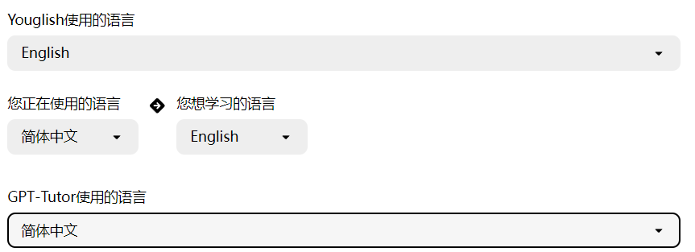

### 语言设置

语言设置中包括四部分的设置，根据你的需要来进行设置，通常只需要完成**GPT-Tutor的语言设置**和**你想要学习的语言**的设置即可。：

#### GPT-Tutor的语言设置

GPT-Tutor的界面使用语言。

#### 你想要学习的语言

你想要学习的语言，设置好后GPT-Tutor就会变成对应语言的老师。

#### Youglish使用的语言

通常和你想要学习的语言相同。在设置完成后，你能够点击这个音响，来使用Youglish查看该单词在YouTube中的真人发音。

#### 你正在使用的语言

通过该设置来让AI在回答时使用你正在使用的语言，否则可能AI会使用英语。

