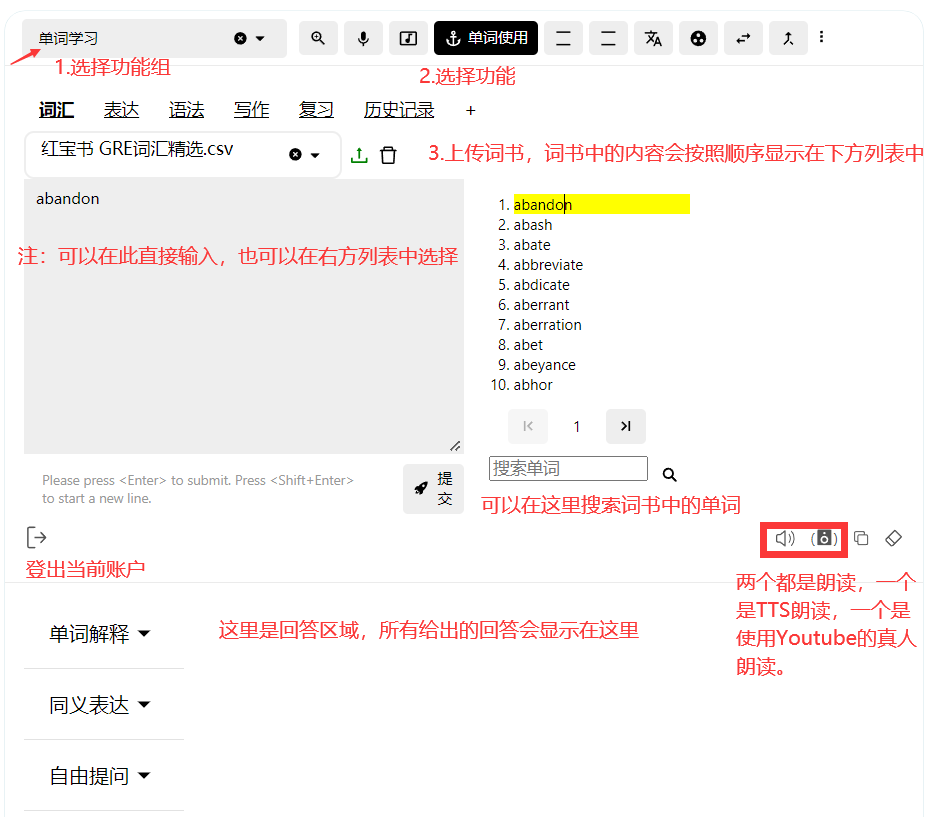
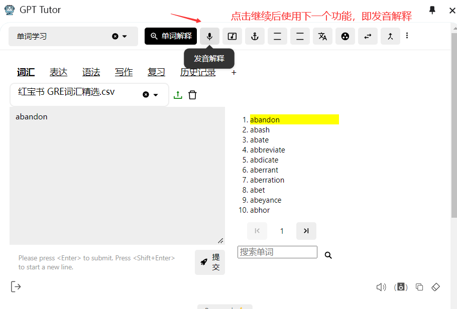

## 主页面功能

### 回答区域

红色方框内的功能分别是：1.重新生成答案 2.朗读 3.复制 4.添加到anki 5.对当前的回答不满意。

然后还有下方的选项：更多解释、继续、添加到复习。

接下来我会做出解释。

### 添加到anki

将当前回答添加到**已经连接好**的anki，在anki中完成复习。

### 对当前的回答不满意

当你觉得当前回答不正确或者不足够好时，你可以点击该选项，然后按照里面的教程进行设置来获得更好的回答。

### 更多解释
如果你为当前使用的功能设置了[辅助功能]，那么你在点击更多解释后它们会显示在列表中，你可以直接选择然后使用，不需要返回到顶部来重新输入。

### 继续

点击后直接按照顺序使用功能选择栏中的下一个功能，不需要返回到顶部。

### 添加到复习

GPT-Tutor中提供两种复习方法：（1）是之前的添加到anki中来完成复习（2）使用GPT-Tutor内置的[复习机制]。

