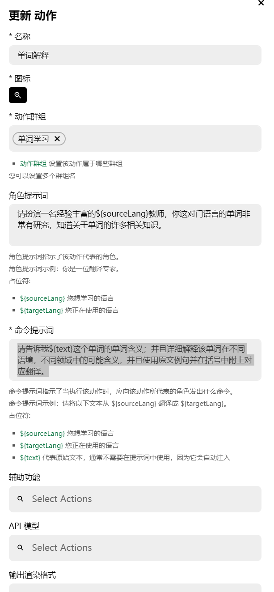
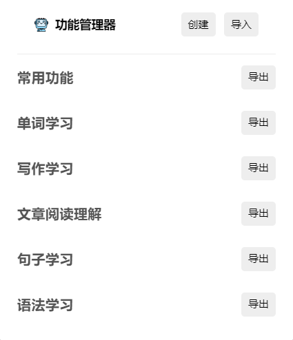

### 什么是prompt（提示词）

你可以简单理解为决定让AI如何回答你的一系列设置，其中一般包括设定ChatGPT回复时使用什么语言，回复内容的格式，需要以怎样的身份来回复这个问题等等。在GPT-Tutor中一个功能的设置主要就取决于你如何设置提示词，这里使用“单词解释”功能的提示词作为示例：

#### 单词解释功能示例

请扮演一名经验丰富的英语教师，你这对门语言的单词非常有研究，知道关于单词的许多相关知识。请告诉我X这个单词的单词含义；并且详细解释该单词在不同语境，不同领域中的可能含义，并且使用原文例句并在括号中附上对应翻译。

### 什么是action（动作，每一个动作构成一个功能）

除了提示词之外，还需要其它设置才能完成一个动作。每一个动作构成了GPT-Tutor中的一个功能，比如图中就是“单词解释”这个功能的“动作”：

### 什么是action group（动作组，或者说功能组）

多个动作集合在一起就是动作组，一般以对应语言和对应学习的类别分类，比如“英语单词学习”，“日语写作练习”。基于不同的动作组，GPT-Tutor可以实现不同的功能；比如“听力单词学习”这个动作组就专门用于学习听力单词，其中的功能相比于一般的单词学习，对于听力进行了特别的调整，比如强调了单词与其它单词连在一起时存在的发音现象，比如爆破音、吞音等等。

