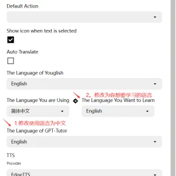

## 使用前设置

使用前需要完成三部分设置，耗时大约2分钟。

### 使用语言设置

### GPT-Tutor设置

在初次打开GPT-Tutor时，你需要设置Default Service Provider（[默认服务提供商]）和API Model（[API模型]），如果你能够正常使用ChatGPT，这里推荐使用ChatGPT Web（免费）。

### prompt组设置

你可以在Action Manager（[动作管理器](./actionManager-explain/main.md)）中创建自己的[prompt组]。

### Anki设置

1.打开Anki。

2.左上角选择工具，然后点击插件。（或者直接Ctrl + Shift +A打开插件）。

3.点击获取插件，输入2055492159下载插件AnkiConnect。

4.下载好后双击打开AnkiConnect，将apiKey设置为"Sol och skyar (Sun and Clouds), Op. 102:No. 5. Majsol ler, Maj (May Sun Smiles, May)"（记得带双引号），然后设置 "webCorsOriginList"为"*"。

[Anki是什么？](https://sspai.com/post/65095)

#### 如何下载Anki
想要使用单词记忆功能，你还需要下载PC端和移动端的Anki。

[PC端Anki](https://apps.ankiweb.net/)

**中国大陆用户**无法打开或下载则请私信或在Telegram中询问。

移动端搜索应用商店即可。

