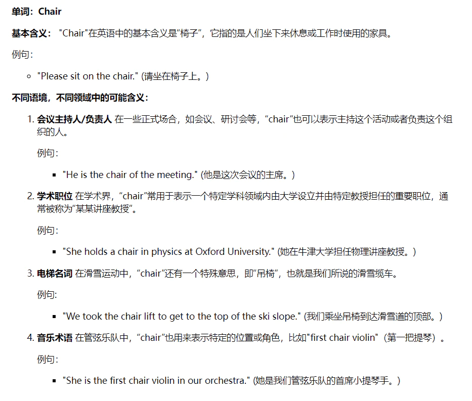
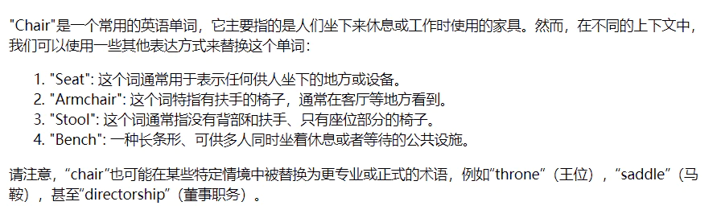
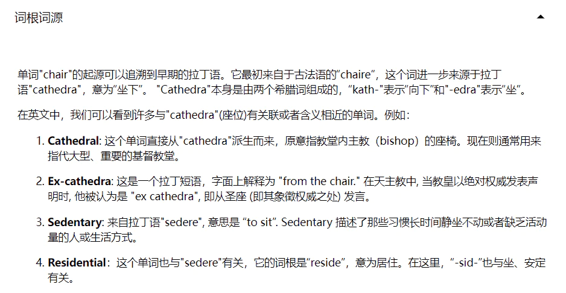
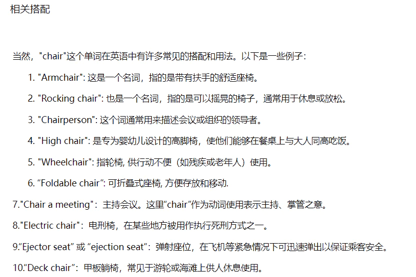

**建议通过[少数派](https://sspai.com/post/91210)来查看该文章，排版会更好。**

在（一）中我们探讨了学习词汇时绕不过去的三个难题，几乎所有单词学习的难题最终都可以归结到这三个难题中，如果解决了这三个难题，那么我们学习单词就能够一马平川，一日千里，是否存在这样一个方法呢？答案是有，那就是接下来要介绍的**语境式学习（Contextual Learning）**。

> 语境式学习（Contextual Learning）是一种教育和学习方法，强调在特定的语境或背景中学习新知识，而不仅仅是孤立地学习概念。这种方法通过将学习内容与实际应用或现实世界中的情境相结合，帮助学习者更好地理解和记忆信息。

**语境就像是大海，而单词是里面的水，跳进大海中，单词的学习就会变得如此自然、简单而轻松。**

这样形容可能不好理解，建议你跳转到[视频19：33](https://www.bilibili.com/festival/jzj2023?bvid=BV1ns4y1A7fj&spm_id_from=333.337.search-card.all.click)处，up主使用非常形象的例子介绍了什么是语境式学习。这里我也使用一个例子来解释什么是语境式学习。

### 母语使用者的学习方法

每一个母语使用者，即使是最“没有文化”的母语使用者，其掌握的词汇量也往往比绝大多数外语学习者要多。为什么？母语使用者能够记住，还能正确使用那么多单词，他们难到不会遇到这三个难题么？

——没错，他们不会，或者说，同样的三个难题对于他们来说只是个小沙丘，对于我们来说则是珠穆朗玛峰，因为我们的学习方法不同。我们使用的是词条式学习，而母语使用者使用的是另一种方法。

#### 词条式学习

> 词条式学习（entry-based learning），有时也称为“条目式学习”或“词汇条目学习”，是一种学习方法，通常用于语言学习和词汇扩展。它的核心思想是通过系统地学习单个词汇项（词条）及其相关信息，以增强对语言的理解和运用能力。

我们的学习方法是**词条式学习，更准确来说，弱化版的词条式学习**。比如像之前提到的”左边dog，右边狗“这种方式就是弱化版的词条式学习，它只学习一个单词的读音、拼写和含义。

**完整版的词条式学习要学习的内容更多，也更困难**，以学习chair这个单词为例，我们整理出来的有关于chair的词条可能是这样的：

**这还只是列出了一部分**，就足够你明显看出这种方法的弊端了——光一个单词就有太多词条和相关信息了，这就是为什么我说**使用词条式学习相当于用一个勺子来挖干海洋**——精卫填海可能都比你有效率些，毕竟人家会飞。

#### 母语使用者如何学习一个单词

假设有一个母语使用者（下文简称为A），他有可能是这样来学习和了解到chair（椅子）这个单词的：

- 在A很小的时候，要吃晚饭了，母亲把他放在椅子上会说“宝宝乖乖，坐在chair上，妈妈喂你”。

 

- 等A再大一些会说话了，可能会指着一把黄色的chair问，“妈妈那是什么？”，妈妈会告诉她“那是一把黄色的High chair（一种为婴儿或幼儿设计的高椅，用于喂食），你小时候很喜欢坐在上面。”

 

- 当看到父亲在房间里办公，A可能会跑进去指着父亲坐的椅子问，“为什么你的椅子比我的高上好多？还可以变高变矮？”父亲告诉他这是Office chair（用于办公室的椅子，通常设计得比较舒适且可以调节高度），是工作专用的椅子。

 

- “那dad你是在做什么工作呢？”父亲回答，“我是一家公司的Chair of the Board（董事会主席）...”

 

像这样的场景还会在A的生活中出现许多次，A会看见不同颜色、不同形状的chair，听见别人使用不同的声调念出chair，在不同情况下、不同语境中使用chair或与chair相关的词语搭配，这些都会帮助到A学习chair。A不必特意创建一个chair的词条，然后费尽千辛万苦去记含义和相关搭配。

我们对chair的学习建立在一张左边写着“chair”，右边写着“椅子”的词条上，而A是建立在视觉、听觉，不同情景、不同语境下上。视频、听觉、当时的情景、语境，无数与chair相关的信息搭成**一张严密的蛛网支撑起A对chair这个单词的认识。这样建立起来的联系是如此稳固又有效，这就是为什么A能够记住，还能正确使用单词。**而且最重要的是，**A几乎没有费任何力气就完成了学习**。

我们所要实现的语境式学习本质上就是对这种学习方法的**尽可能模仿**。

关于语境式学习更多的例子你可以查看[视频的第二章](https://www.bilibili.com/festival/jzj2023?bvid=BV1ns4y1A7fj&spm_id_from=333.1007.top_right_bar_window_history.content.click)。

### 实现语境式学习的难点

既然语境式学习如此强大，那么我们这些外语学习者，能否也像A一样，使用语境式学习，记得又稳固、又深入，而且还很轻松呢？答案是能，但没那么简单。

**语境式学习的第一个难点在于如何找到语境**。对于母语使用者来说，他们的生活便是语境，而大部分外语学习者显然没有这样的生活环境（部分国际学校例外），我们只能通过其它方式来实现，比如视频里推荐的阅读。

#### 阅读
在视频里博主推荐通过阅读来实现语境式学习（具体实现方式请查看视频33：59），这确实是一种可行的方法，通过观影/剧也是相同的道理，我在大学时也是通过阅读有效提高了我的英语水平。但要实现这种方法也存在诸多的困难。

以我自己为例。我在初中的时候买得一本Wuthering Heights（《呼啸山庄》），**在经历了多次十个单词里有七个就要查字典后，我果断放弃了阅读**。我当时觉得，这还不如我背教材书呢，**至少背教材书我能坚持1小时，看书我看5分钟就看不下去了**。

#### 可理解输入
问题就出在阅读并不是随便拿起一本书来就读，而是需要找到比你当前语言水平高一点的读物。语境式学习的方法的重点是，在可理解的语境中学习不认识的单词（这就是视频中提到的[可理解输入](https://www.bilibili.com/festival/jzj2023?bvid=BV1ns4y1A7fj&spm_id_from=333.1007.top_right_bar_window_history.content.click)）。

高一点如何衡量？一段完整的表达中最多只能存在1-2个你不认识的单词，这样你才能大概读懂这句话，像我那样一句话有7个不认识就说明这读物已经远远超过我的英语水平，这样的读物是无法让我学习到单词的，只会让我望而却步。

实际上母语使用者在学习中也是如此。比如在先前的例子中，A在学习high chair这个单词时，他只是不理解那个物品（high chair）是什么，而不是既不理解什么是high，也不理解什么是chair，更不一个英语单词都不认识。

**如果我们能找到比你当前语言水平高一点的读物，我们就能通过该读物来在语境中学习我们不认识的单词**。

#### 阅读作为方法的缺点

初中的我如果要应用阅读的语境式学习方法会遇到两个困难，首先我不知道自己的英语水平究竟怎样，其次我也不知道如何找到比自己语言水平高一点的读物。

后来在高中我才知道有**新概念英语**，它按照语言水平从低到高配套了一系列读物；视频中up主也推荐了一整套语言水平从低到高的书籍。

看似万事俱备，只差实践了，但当你买好书籍，把它们摆在面前开始读上两篇时，你马上就会意识到，问题还没解决：

**书是找好了，但你能坚持读下去吗？**

书里可能介绍了非洲某种狮子的生活习惯，可能介绍了某个企业的发家史，可能介绍了NASA的一次火箭发射，但你现在更兴趣的可能是：**今晚吃什么**。于是你看着看着打开了外卖，或者是打开了短视频查看某个菜怎么做。

你可能会自责自己怎么这么不专心，马上把手机丢得远远的，发誓自己一定要专心读完这一页，但你有没有想过为什么你玩游戏时能一直玩，不想着点外卖或刷短视频呢？

**事实是这并不是因为你不够专注，读书时想到吃，是因为书里的情景和语境并不适合你，不能够吸引你完全投入**。英语文章里描述的许多生活习惯和人文风俗我们都没有经历过，无法在我们的现实生活中产生对应的联系，它们只是一座座“孤岛”，即使是读中文我们可能都觉得枯燥乏味，更何况还是外语。

#### 找到自己感兴趣的读物

**解决方法还是找到更适合的读物，这次不只是要找到比自己语言水平高一点的读物，而且是自己感兴趣的读物**。找到比自己语言水平高一点的读书是为了让自己能够读懂，但只有找到你自己感兴趣的读物你才能坚持下来。

作家村上春树就自述他中学时期成绩稀烂，但只有英语经常考得很好，就是因为他对英文侦探小说非常感兴趣，闲暇时间都在家里阅读侦探小说。村上春树并不是严格去找一些比他语言水平高一点的读物，实际上他也说最开始有许多看不懂的单词，但他选择跳过看不懂的，直接看自己能看懂的，即使是这样，因为坚持了下来，大量的阅读也使得他仍然能够有效提高他的英语水平，后来他甚至能够用英文创作。

由此可见如果“比自己语言水平高一点”和“自己感兴趣”只能选一个，那么可能自己感兴趣更重要，因为坚持阅读才是最重要的。

但事情还没有这么简单。

如果你喜欢侦探小说，那自然而然很容易能够找到对应的读物（只是可能比较难找到比自己语言水平高一点的侦探小说），但如果就像我之前说的，你现在最感兴趣的是今晚吃什么呢？有什么书的主题是“今晚吃什么”吗？——这并不是一个无厘头的问题，这里透露出来的问题是：**我们实际上只有非常少类型的书籍可供选择，而每个人感兴趣的事物又大不相同。**

比如如果我就喜欢吃美式快餐，那么我能否找到介绍各种汉堡、薯条、炸鸡、奶昔、热狗的口感，而且刚好比我语言水平高一点的读物呢？在过去显然不可能，无论是新概念英语，还是什么概念英语，都不可能为你提供如此个人化的读物，但是现在——**大人，时代变了**！