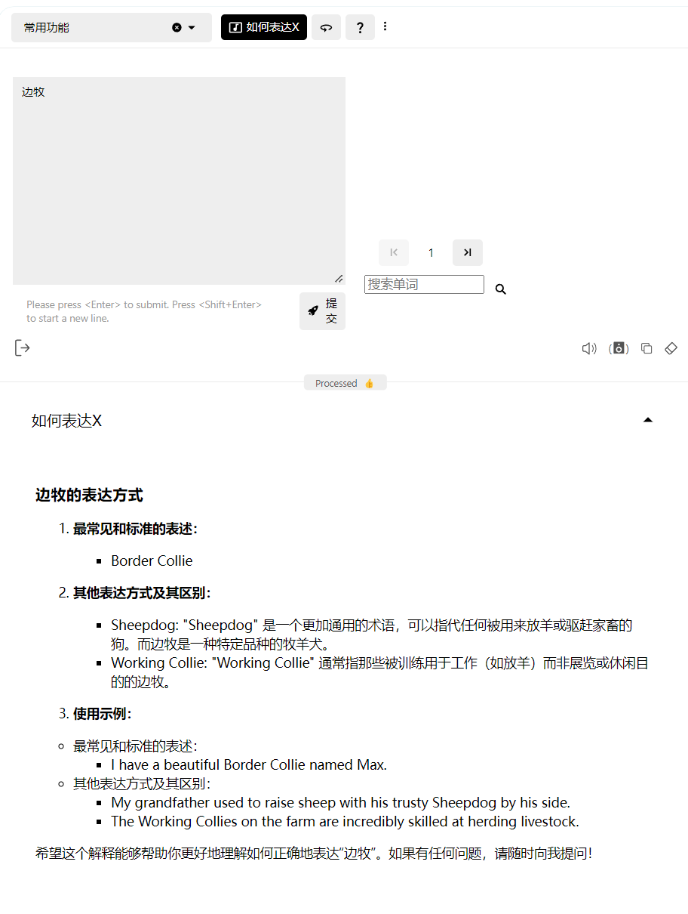

# How to Use AI to Help You Remember a Word Forever

I recommend reading this article along with the video: [How to Remember a Word Forever](https://www.bilibili.com/festival/jzj2023?bvid=BV1ns4y1A7fj&spm_id_from=333.337.search-card.all.click)

The video mentions three challenges in word learning:

1. The arbitrary symbol problem
2. The breadth problem
3. The depth problem

These three challenges well explain two ultimate questions we face when learning foreign language vocabulary:

1. **Why can't we remember words**

2. Why do we **remember** so many words, but still **can't use them** when reading and writing

The purpose of this article is to explain how to use AI to solve these three challenges, thereby addressing these two ultimate questions.

## The Arbitrary Symbol Problem

> The "arbitrary symbol problem" refers to the arbitrary relationship between the form of linguistic symbols (such as vocabulary) and their meanings. In other words, there is no inherent logic or natural connection in this relationship. In English, there is no natural connection between the form of the word "dog" and the animal it refers to (dog). This connection is conventional, and other languages might use different forms to represent the same meaning, such as "狗" in Chinese or "chien" in French.

For native speakers, from infancy, they need to learn the pronunciation, spelling, and the concepts and meanings that words represent simultaneously. For foreign language learners, they only need to learn the referential symbols in another language, because we have already acquired the images, concepts, and meanings of most things when learning our mother tongue. For example, we already know what the animal "dog" is, we have the image and concept of "dog", and next, we only need to learn how to express it in another foreign language.

This is actually an **advantage**. We don't need to re-observe, experience, and understand what a "dog" is. This is also the **Common Sense Advantage (Word Knowledge Advantage)** mentioned in the video. This advantage can effectively help our word learning, but we haven't utilized this advantage well in our learning because we **haven't established the connection between foreign words and our existing common sense**.

### Establishing Connections

Learning a foreign language can essentially be understood as establishing connections between the concepts and meanings of dog that we have already learned, and the pronunciation and spelling of "dog" in the foreign language. The **way and direction we establish connections** determines whether these connections are stable and effective.

We usually learn the word "dog" like this:

**First learn the word "dog", then consult textbooks or dictionaries to know that it means "狗".**

This learning method makes our connection start from a completely unfamiliar symbol "dog", then lead to the familiar symbol "狗" in our mother tongue, and then use the common sense advantage to directly understand what a dog is. Here, a **one-to-one single-line connection** from "dog" to "狗" is established, but this may not be an **appropriate connection method and direction**.

Learning/memorizing is essentially establishing a **new connection (neural synapses)**, and if a connection is to be established starting from something completely unfamiliar, the difficulty will be much higher. Think about it, comparing learning new content in a subject we are already familiar with and learning new content in a completely unfamiliar subject, which one is easier? Even emotionally, we have an instinctive aversion to completely unfamiliar things.

Of course, you might think, the first time learning is of course unfamiliar, that's why we need to learn, right? — But this is not the case. By making good use of the **Common Sense Advantage** mentioned earlier, we don't need to start completely from "unfamiliar". We already have the concept and meaning of "dog". Since establishing from unfamiliar → familiar is more difficult, why don't we reverse it and **start establishing connections from familiar things** by leveraging our existing common sense advantage?

### Start Establishing Connections from Familiar Places

Have you ever thought about this possibility: English textbooks should reverse the order, placing the meaning of words on the left side and the corresponding English words on the right side.

This way, when we learn words, we first see the meaning of the word. For example, we first see that the meaning of dog is "狗", recalling the concept and image of "dog", thinking of the sleeping puppy at home, the stray dogs seen on the street, thinking of Snoopy... Then you have a question in your mind, how to refer to a dog in English? At this time, you see "dog", and now dog is connected with all your previous associations.

Do you see the difference? In between, the connection we established was a connection between two signifiers, a **single-line connection** between "dog" and "狗". Now, what we have established is a **multi-line connection** between the concept and image of "dog", the sleeping puppy at home, the stray dogs seen on the street... many, many things and "dog". Which is more stable, connecting with one line or connecting with many, many lines? The answer is obvious.

The difference will be even more obvious when reviewing. After establishing such multi-line connections, whenever you see one end of the line — seeing a stray dog on the street, seeing your puppy at home, seeing a dog in cartoons/movies, or even just these concepts appearing in your mind, you will unconsciously recall the other end of the line — repeating the corresponding English word dog. Each repetition is equivalent to a "painless" review. You will find that learning and memorizing words in this way is both easy and more effective.

### Native Speaker's Learning Method

Every native speaker, even the most "uncultured" native speaker, often has a larger vocabulary than the vast majority of foreign language learners. Why? Why can native speakers remember and correctly use so many words, while foreign language learners cannot? The problem lies in the learning methods of foreign language learners.

How does a native learner usually learn and remember a word? Suppose there is such a native learner (hereinafter referred to as A), he might learn and understand the word "chair" like this:

- When A was very young, it was time for dinner, and his mother would put him on a chair and say, "Baby be good, sit on the chair, mommy will feed you."

- When A grew a little older and could speak, he might point to a yellow chair and ask, "Mom, what's that?" Mom would tell him, "That's a yellow High chair (a type of chair designed for infants or young children, used for feeding), you used to love sitting on it when you were little."

- When seeing his father working in the room, A might run in and point to the chair his father was sitting on and ask, "Why is your chair so much higher than mine? And it can go up and down?" Father tells him this is an Office chair (a chair used in offices, usually designed to be comfortable and adjustable in height), it's a chair specifically for work.

- "Then dad, what kind of work are you doing?" Father answers, "I am the Chair of the Board (chairman of the board of directors) of a company..."

Scenes like this will appear many times in A's life. You will find that A's learning and review of "chair" is not based on a piece of paper with "chair" written on the left and "chair is a piece of furniture with four legs" on the right, but on multi-line connections established in different contexts with visual (seeing chairs of different colors and shapes), auditory (different people repeating this word with different intonations). The connections established in this way are so stable and effective, like a tight spider web supporting A's understanding and use of the word "chair".

This is also the **Contextual Learning** mentioned in the video, which will be a very effective learning method. However, this method has been too difficult to apply and thus has not been widely promoted, until the emergence of AI.

> Contextual Learning is an educational and learning method that emphasizes learning new knowledge in specific contexts or backgrounds, rather than just learning concepts in isolation. This method helps learners better understand and remember information by combining learning content with practical applications or real-world situations.

### How GPT-Tutor Helps You

GPT-Tutor has multiple functions to help you start establishing connections from familiar places and practice contextual learning. The following are just examples.

1. How to Express X

You see your puppy sleeping in front of you, you think it's a Border Collie, and you want to know how to express "Border Collie" in English. You can choose the "How to Express X" function and then enter "Border Collie":

You come home at night and still have a lot to do. You feel "there's so much to do" and want to know how to express this in English:

2. Scenario Expression

You can also input a familiar scenario to get English expressions related to that scenario. For example, input "bedroom", and you will get the following answer:

### Custom Word Book

**High customization** is also one of the important features of GPT-Tutor. You can create your own word book based on your discipline, profession, hobbies, etc., instead of relying on so-called authoritative word books (such as Red Book, Blue Book).

For example, you can record the things, concepts, and scenarios you want to know about in a day in your memo, and then use ChatGPT or other tools to help you organize it into a csv format word book (this function will be directly implemented in GPT-Tutor in the future), and then import it into GPT-Tutor.

#### Example

Suppose the things, concepts, and scenarios you want to know in a day are like this:

1. Morning grumpiness.
2. Bicycle.
3. School.
4. Physical education class.
5. Tired.
6. Can't finish homework.
7. Movie theater.

Then copy this list to ChatGPT and let it help you organize it into a csv file (as shown in the figure):

Download the file, and you will get a csv format file list:

We import it into GPT-Tutor, and the entire list will be displayed in GPT-Tutor:

Let's try and see how it works:

Bravo! It works great!

### Review

You can use the famous memory software Anki, or use the built-in review mechanism in GPT-Tutor to complete the review. For details, please check [How to Review](/docs/problem/review.md)

## The Breadth Problem

The breadth problem refers to the fact that a word has completely different meanings in different contexts, and it is difficult to understand the accurate meaning of the word if we don't understand the corresponding context.

### Polysemy

The breadth problem is caused by multiple factors, the first of which is the polysemy of words. A word may have multiple meanings, and the more common the word, the richer and more diverse meanings it has in different contexts. Taking "by" mentioned in the video as an example:

Usually, when we first start learning this word, we only learn the meaning of "next to". However, in this sentence, "by" has five meanings:

- I found the book by Dickens by chance by the tree and shall return it by mail by Friday.

Here, the first "by" means "created by someone", the second "by" means "under certain circumstances", the third "by" means "next to", the fourth "by" means "through a certain method", and the fifth "by" means "at a certain time".

If you only know the meaning of "by" as "next to", you won't be able to understand the meaning of this sentence.

Before the emergence of AI, if we wanted to understand the five meanings of "by" through reading, we might need to consult textbooks, dictionaries, or search engines to fully understand the meaning and usage of "by". Now, you just need to click on the "Word Explanation" function and then enter "by" to get the result, which includes not only the explanation of the meanings but also the corresponding contexts and example sentences:

### Multi-word Combinations (Fixed Collocations)

Another factor causing the breadth problem is that a word does not only function independently, but also forms fixed collocations with other words, and most of the time we cannot deduce the meaning of these fixed collocations from the words in the phrase. For example, still using "by":

- by the way (incidentally)
- by all means (certainly, by any possible method)
- by and large (on the whole)

You can cover the meanings on the right and try to see if you can deduce the meanings of the above fixed collocations even if you already know the five meanings of "by".

AI can also quickly help you learn fixed collocations related to "by":

### How GPT-Tutor Solves the Breadth Problem

If you plan to use the **entry-based learning** method to learn words, GPT-Tutor uses a series of functions to help you extend the breadth of the word. This way, when you learn "by", you learn not only the meaning of "next to", but also all common meanings and common word collocations, and even related information such as synonyms and antonyms.

> Entry-based learning, sometimes also called "item-based learning" or "lexical entry learning", is a learning method typically used for language learning and vocabulary expansion. Its core idea is to systematically learn individual lexical items (entries) and their related information to enhance understanding and application of the language.

However, if we follow the entry-based learning method, there is an obvious drawback: trying to remember a large number of different meanings, fixed collocations, and even more related content of words through rote memorization might be like trying to empty the ocean with a spoon, especially for people with not-so-good memory. Then we need another method mentioned earlier: **contextual learning**.

### Contextual Learning

In the video, the blogger recommends solving this problem through **contextual learning**—more accurately, through reading. Because in reading, a word appears in a full context, it is no longer an isolated island, but a node in a network full of connections, and this network will jointly support our learning of this word node. The principle here is actually the same as the "dog" I mentioned earlier. We use existing connections to help you establish new connections, and then these connections will support and reinforce each other, so that the entire memory network will become more and more stable.

Undoubtedly, this is certainly a more effective method, and it might also be one of the most effective methods in the past, but, **times have changed**, with AI, through GPT-Tutor, we can achieve more efficient methods.

#### Creating Context

The method of contextual learning is correct, but the method of achieving contextual learning through reading has several obvious drawbacks: (1) It cannot address pronunciation and listening (2) It's too broad, leading to low efficiency (3) Not everyone is suitable for reading

(1) can be solved through listening to audiobooks, and many apps have already solved this problem to a considerable degree, but the problems of (2) and (3) cannot be solved, as they are inherent flaws in the reading method itself.

Since we read to obtain a context and learn the meaning of vocabulary in context, if we can directly let AI generate a context for vocabulary, do we no longer need to read? Let's try:

This is already quite good even without adjusting the prompt. AI is equivalent to directly extracting sentences containing "by" from books for you, so you no longer need to understand the meaning of "by" in context through reading, but directly obtain the corresponding context to learn the corresponding meaning of "by".

#### Creating More Familiar Contexts

AI can do even more. It can not only create contexts but also help set up more familiar contexts based on your profession, age, and the scenarios you set, etc. More familiar contexts can more effectively help us establish connections with unfamiliar words and subsequent reviews.

For example, if you are an office worker and often need to take the subway, then you set your scenario on the subway. This way, every time you take the subway, you might recall that context and the vocabulary learned in it, completing the review painlessly.

## The Depth Problem

The depth problem of words is easy to understand. To express the same emotion, such as anger, there might be different words in different languages. We know that there are "angry" and "enraged" to express anger. The teacher tells us that "enraged" is an advanced vocabulary, so we always use advanced vocabulary "enraged" when we want to get high scores, but this actually results in lower scores. This is because we haven't really understood the difference in meaning and usage between the two. If you use "angry", it might be correct but just not "literary" enough, but if you use "enraged", it might be completely wrong. In fact, to express the emotion of "angry", there are also words like: ······, each of which expresses anger, but expresses different degrees of anger in different situations. One of the standards of high writing level is to be able to master the depth of a word and use it correctly.

Before the emergence of AI, learning the differences between so many words and similar words was too difficult. Basically, we could only ask native speakers or carefully consult dictionaries for comparison. I have asked about the subtle differences between certain words on Reddit multiple times. But with the emergence of GPT-Tutor, you only need to use the "Expression Comparison" feature:

Just like when solving the breadth problem, when solving the depth problem, you can also use GPT-Tutor to implement contextual learning, better understanding the use of different words by creating different contexts. The specific operation is the same as before, so I won't demonstrate it again here.

## Follow-up

Due to length limitations, this article only explains the approach and some functions of GPT-Tutor for learning words. In the next article, I will introduce more detailed and comprehensive usage.

If this has been helpful to you, you can support my work on [Afdian](https://afdian.com/a/zy1999) or [Patreon](https://www.patreon.com/yaoyaoyao/posts).