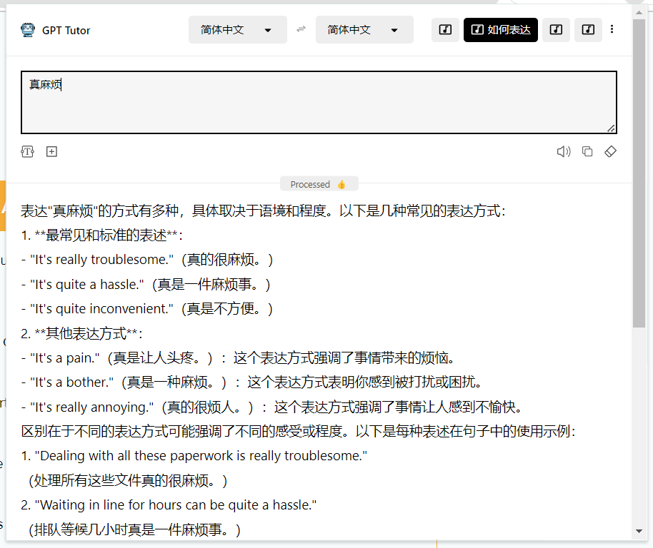

Here's a translation of your content about expression learning and how GPT-Tutor helps with practicing expressions:

## What is Expression Learning?

Expression learning is a step beyond vocabulary learning. Instead of focusing on isolated words, we learn **complete expressions**.

> What are expressions? In IELTS speaking tests, for example, oral skills are evaluated based on four aspects: pronunciation, grammar, vocabulary, and fluency. Grammar, vocabulary, and fluency can all be understood as assessments of expression. Many language learners spend too much time and effort on pronunciation, neglecting the crucial practice of expressions. In reality, both in daily life and in exams, various accents are acceptable, and perfect pronunciation isn't essential. What matters most is **correct and accurate expression**.

## How GPT-Tutor Helps You Practice Expressions

GPT-Tutor offers three methods to practice English expressions. Using these methods progressively can effectively improve your English expression skills.

### Method 1: Practicing Basic Expressions

As mentioned earlier, find a book that records English expressions (common collocations, idioms, sentence patterns, etc.), such as "1000 Pure British Phrases and Sentences That Will Make You Sound More Like a Native Speaker in IELTS Writing and Speaking Tests". Add these expressions to Anki for learning and memorization, allowing you to learn English expressions much like you learn vocabulary.

Of course, you don't have to stick strictly to the book's content. You can learn and memorize expressions you want to know at any time. For instance, if you're busy at work, you might want to know how to express "I have so much to do". You can use the "How to Express" feature - input the Chinese, and it will provide the corresponding idiomatic English expression.

Expression learning can start from a thought that pops into your mind. For example, if I have a lot to do today and want to know how to express "事情好多啊"(Chinese) in English:

After having so much to do, how do I feel? Naturally, I might think "真麻烦". So I also want to know how to express "真麻烦".

Riding an electric bike through a busy intersection, you might want to know traffic-related expressions. Use the "Expression Learning" feature for this.

Input 交通(traffic):

When reading a magazine, you come across the expression "cloak of secrecy" and don't recognize this word. You can use the "How to Express" feature.

### Method 2: Practicing Basic Paragraph Expressions

This is an advanced version of Method 1. When you know enough expressions, you might be able to speak a relatively complete content. At this point, you need to organize and expand expressions into a paragraph. This is where you use the "Topic Expression" feature in GPT-Tutor. You input a topic, like "My favorite sport is running", and GPT-Tutor will provide a complete expression. You can learn this topic expression just like you learn vocabulary.

You can directly use the "Topic Expression" feature to memorize and learn topic expressions like vocabulary. However, I recommend that you complete a full content expression based on it, then use the "Evaluate and Revise" feature to improve it, before adding it to Anki.

### Method 3: Real Scenario Practice

When we're proficient enough with expressions and organizing specific paragraphs, we can try using and practicing our learned expressions in real scenarios. If you're in a region supported by OpenAI, you can use ChatGPT directly on your phone to simulate more realistic speaking practice. I'll be releasing video tutorials on this in the future.

