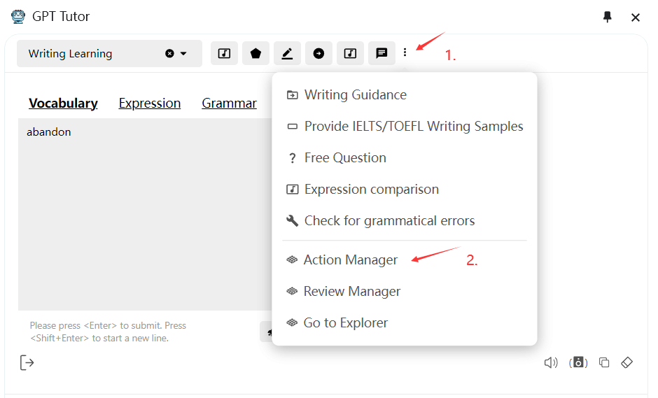

**Action Manager**

The Function Manager stores and defines all the functions you use, such as “Word Explanation” and “Grammar Correction.” You can add new functions, or delete and update existing ones here. You can also import or export all functions at once.

### How to Access

### How to Create a New Function

1. Open the Function Manager.

2. Click on "Create."

3. Enter the relevant information.

### How to Update or Delete Existing Functions

1. Open the Function Manager.

2. Locate the function you need to modify.

3. Hover your mouse over the box of the function you want to modify, and “Update” and “Delete” buttons will appear on the right.

4. Enter the relevant information.

### Special Notes

#### Auxiliary Functions

Auxiliary functions serve two purposes:

1. When using ChatGPT (Web), the auxiliary function will use the same conversation as the current function, allowing it to directly access the context of the current conversation.

2. If the current function requires additional steps to be implemented (e.g., if you divide a copy task into two steps), you can handle these extra steps in the auxiliary functions.

#### API Models

Pre-set the model required for the function (assuming you have completed the related settings on the configuration page).

**Different functions require different models, and various models come with different costs, response speeds, and accuracy levels.** To balance cost and effectiveness, you may need to switch between models frequently. For example, a basic word meaning explanation might only require the simplest model, GPT-3.5 (as the difference between GPT-3.5 and GPT-4 is minor for basic meanings, but GPT-4 is significantly more expensive). However, for sentence structure analysis, GPT-4 is necessary (as it provides much better analysis).

You can assign very simple functions that need speed to the fastest LLM, allocate large tasks that don’t require top-notch results to local LLMs, and assign functions that require good results but are cost-sensitive to ChatGPT Web (if you subscribe to Plus, you can use GPT-4 directly). This approach saves both time and money.

---