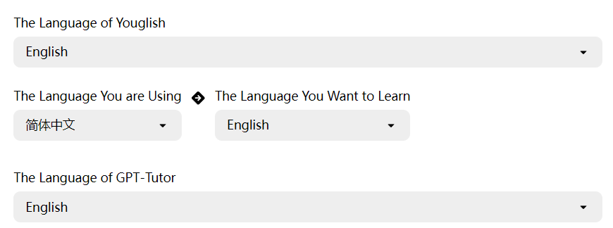
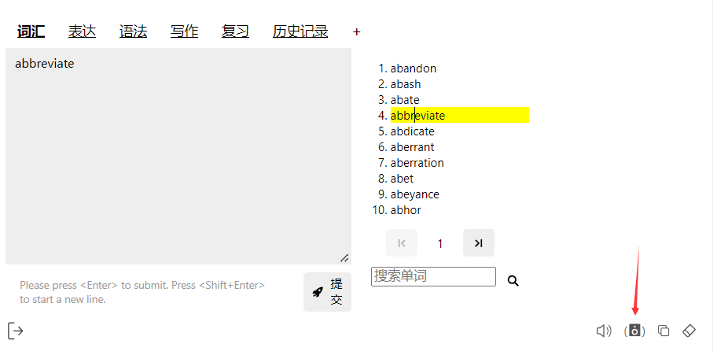

## **Language Settings**

The language settings consist of four parts. Typically, you only need to configure the **GPT-Tutor language settings** and **the language you want to learn**:

### GPT-Tutor Language Settings

This setting determines the language of the GPT-Tutor interface.

### Language You Want to Learn

Set the language you want to learn here. Once configured, GPT-Tutor will act as a teacher for that language.

### Youglish Language

Usually set to the same language you want to learn. After setting it up, you can click the speaker icon to use Youglish to hear the pronunciation of words by real speakers on YouTube.

### Language You Are Using

Use this setting to ensure that the AI responds in the language you are currently using. Otherwise, the AI might respond in English.

---

