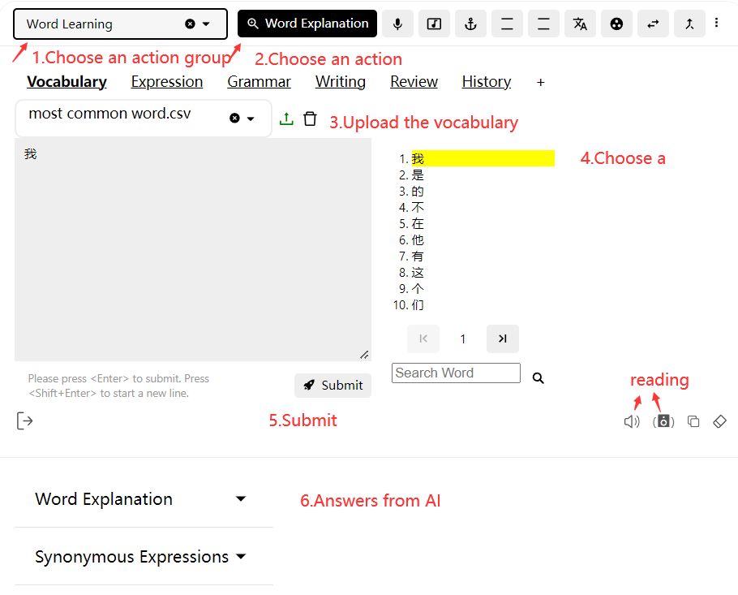
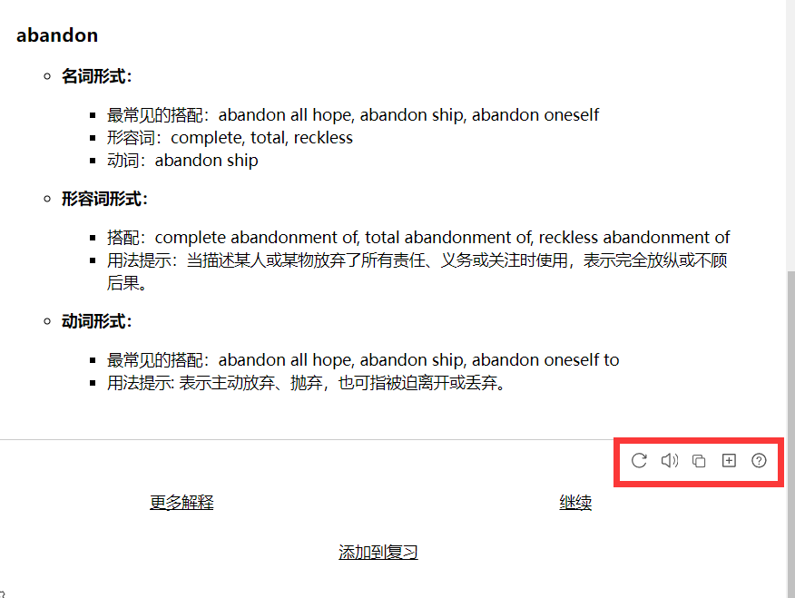
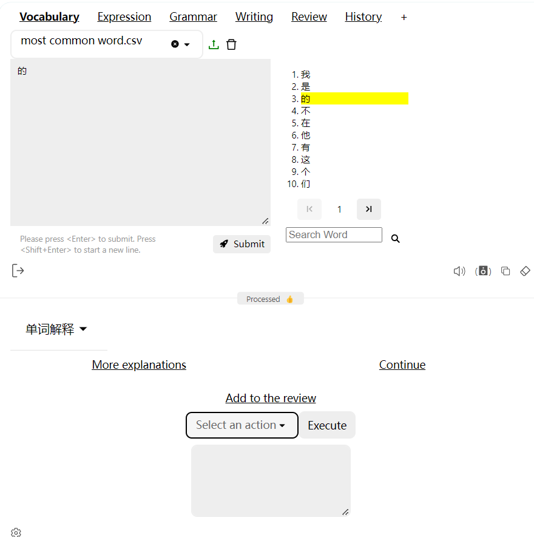
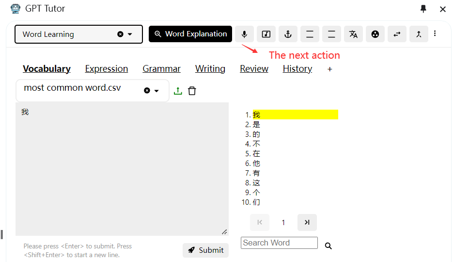
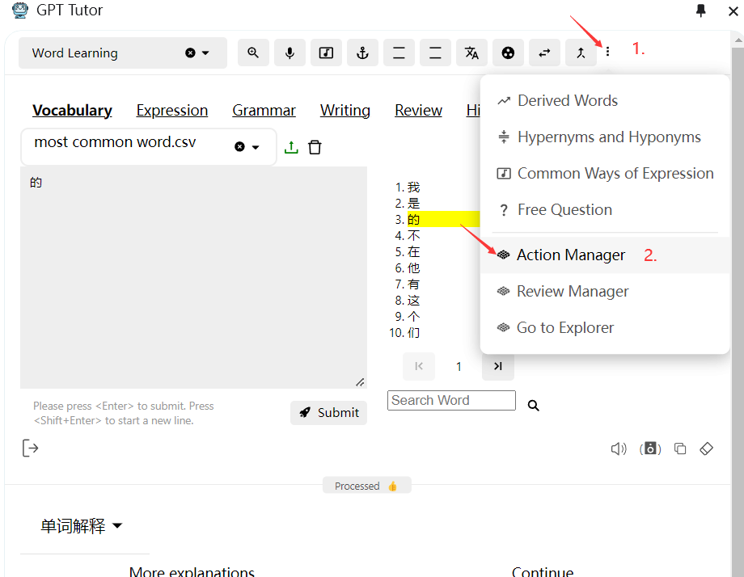
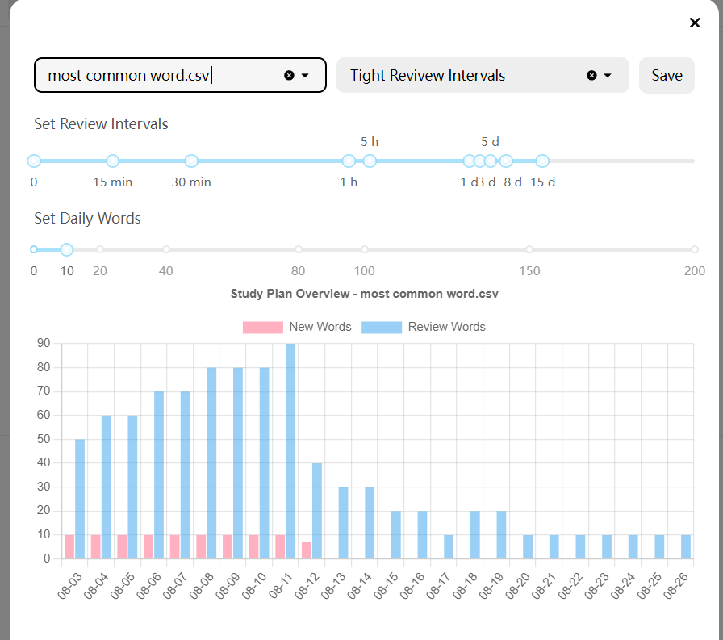

Here is the translation of the content:

---

## Main Page Features

### Answer Area

The functions within the red box are: 1. Regenerate answer 2. Read aloud 3. Copy 4. Add to Anki 5. Dissatisfaction with the current answer.

There are also options below: More explanations, Continue, Add to review.

I will explain these next.

### Add to Anki

Adds the current answer to the already connected Anki for review within Anki.

### Dissatisfaction with the Current Answer

If you think the current answer is incorrect or not good enough, you can click this option and follow the tutorial inside to get a better answer.

### More Explanations

If you have set up [auxiliary functions] for the current feature, when you click for more explanations, they will appear in the list, allowing you to select and use them directly without having to return to the top to re-enter the information.

### Continue

Clicking this will use the next feature in the feature selection bar in order, without needing to return to the top.

### Add to Review

GPT-Tutor offers two methods for review:

1. Connect to Anki and complete the review by adding to Anki.
2. Use the built-in review function of GPT-Tutor. If you need to complete the review on a mobile device, Anki is recommended. If you only need to complete the review on a computer, then the built-in review function of GPT-Tutor is suggested.

#### Using Anki for Review

1. Open Anki.
2. Select Tools in the top left corner, then click on Add-ons. (Or press Ctrl + Shift + A to open Add-ons directly).
3. Click on Get Add-ons, enter 2055492159 to download the AnkiConnect add-on.
4. After downloading, double-click to open AnkiConnect, set the apiKey as "Sol och skyar (Sun and Clouds), Op. 102:No. 5. Majsol ler, Maj (May Sun Smiles, May)" (include the quotes), and set "webCorsOriginList" to "*".
5. Use the "Add to Anki" function to add the current answer to Anki.

[What is Anki?](https://sspai.com/post/65095)

##### How to Download Anki
To use the vocabulary memory function, you also need to download Anki for both PC and mobile devices.

[PC version Anki](https://apps.ankiweb.net/)

**Users in Mainland China** who cannot open or download, please send a private message or ask on Telegram.

Search in the mobile app store for the mobile version.

#### GPT-Tutor Built-In Review Function

##### 1. Open the Review Manager

##### 2. Select a vocabulary book you need to learn and review

##### 3. Set the review interval and the number of words to learn each time

- The Ebbinghaus forgetting curve proves that to remember something long-term, it needs to be reviewed and reinforced at specific intervals. Anki conducts reviews based on this curve, and GPT-Tutor offers a similar review method.

- Besides offering standard memory cycles, GPT-Tutor allows for quick and easy adjustment of these cycles because each person's memory cycle might differ. You can adjust your memory cycle by changing the review intervals.

- After setting the memory cycle, GPT-Tutor will draw a study plan chart (as shown). Based on the current cycle and the number of words learned each session, the chart calculates the time needed to complete the learning and review of the entire vocabulary book and the number of words needed to review each day.

