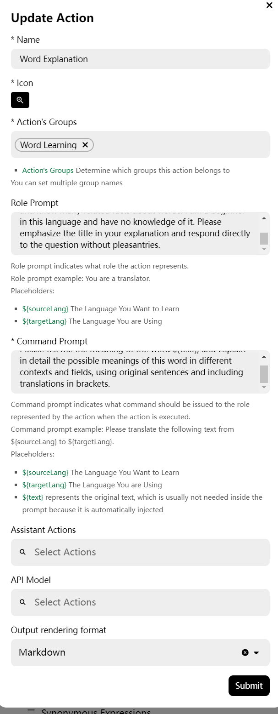
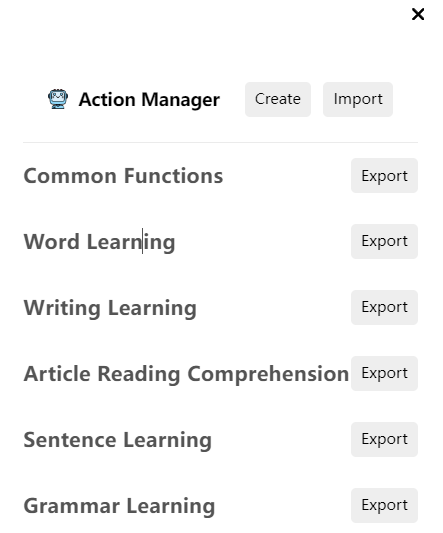

### What is a Prompt?

A prompt can be simply understood as a set of instructions that determines how the AI will respond to you. This generally includes setting the language for ChatGPT’s responses, the format of the reply, the persona from which the response should come, and so on. In GPT-Tutor, the functionality of a feature mainly depends on how you set the prompt. Here is an example of a prompt for the "Word Explanation" feature:

#### Example of the Word Explanation Prompt

Please act as an experienced English teacher with deep knowledge of words in your native language. You know a lot about the word’s meanings and can explain it in various contexts and fields. Please provide the meaning of the word X, and explain its possible meanings in different contexts and fields. Also, include original example sentences with translations in parentheses.

### What is an Action?

In addition to prompts, other settings are required to complete an action. Each action constitutes a function in GPT-Tutor. For example, the image shows the “Word Explanation” function’s action:

### What is an Action Group?

An action group, or function group, is a collection of multiple actions, generally categorized by language and learning type, such as "English Vocabulary Learning" or "Japanese Writing Practice." Based on different action groups, GPT-Tutor can perform various functions. For example, the "Listening Vocabulary Learning" action group is specifically designed for learning vocabulary related to listening, with special adjustments compared to general vocabulary learning, such as emphasizing pronunciation phenomena like plosives and elision when words are connected.

