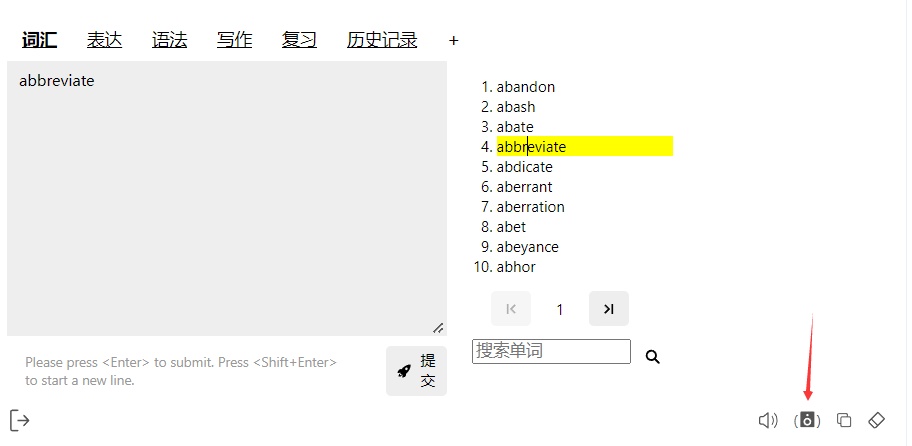

## Pronunciation Settings

Pronunciation settings in GPT-Tutor define how words, sentences, and responses are pronounced. GPT-Tutor offers three modes of pronunciation: Youglish, EdgeTTS, and ChatGPT (Web). Please choose according to your needs.

### Youglish Settings

Typically set to the same language you want to learn. Once set, you can click this speaker icon to use Youglish to hear real-life pronunciations of the word on **YouTube** (meaning you need access to YouTube to use this feature).

### EdgeTTS Settings

The default pronunciation setting. EdgeTTS supports multiple languages and allows adjustments to volume and speed. You need to select EdgeTTS as the TTS Provider, then add a voice under Voice, like I have added Simplified Chinese here. Adjust the Rate and Volume to set the reading speed and volume.

### ChatGPT Web

If you are using ChatGPT Web, it is highly recommended to select the options here marked with ChatGPT Web, such as Ember, Cove, Sky. Their readings are more realistic, smooth, and human-like.

