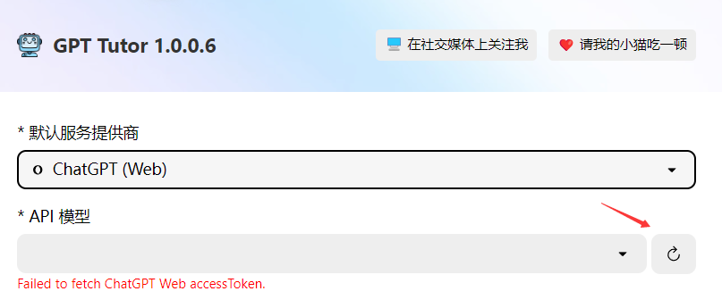
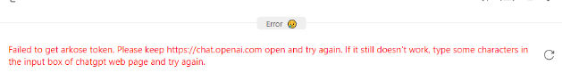
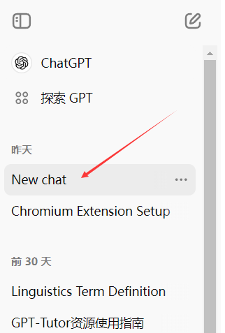

Here is the translation of the content:

---

## Potential Issues and Solutions When Using ChatGPT (Web)

If you are able to use ChatGPT normally, it is highly recommended to set ChatGPT (Web) as the Provider in GPT-Tutor. It is not only free but also unlocks more features.

You may encounter the following issues during use:

### Unable to Obtain accessToken (as shown)

#### Solutions:

1. Click the "Retry" button on the right side, repeating three to four times, which usually allows you to obtain the accessToken.

If you are unable to obtain it after several refreshes, check if you can connect to [ChatGPT](https://chatgpt.com/) normally. If you can connect to ChatGPT but still can't obtain the accessToken, then you should:

2. Delete cookies from the ChatGPT webpage, log out of your account, log back in, and then return to this page on GPT-Tutor to try retrieving the accessToken again.

### Unable to Obtain arkoseToken (as shown)

#### Solutions:

1. Open [ChatGPT](https://chatgpt.com/), submit a random question, wait for the answer, and then reopen GPT-Tutor to see if it works.

2. If it still doesn’t work, open [ChatGPT](https://chatgpt.com/), check the chat history for the appearance of a "New Chat" as shown in the image, open it, click regenerate, wait for the answer, and then reopen GPT-Tutor.

Usually, after the above operations, you should be able to use ChatGPT Web normally. If it still does not work, it may be due to your VPN or your account being considered at risk by OpenAI, preventing usage. In such cases, it is recommended to use other free Providers (such as Kimi and ChatGLM, though the effects may not be as good as ChatGPT) or paid Providers.