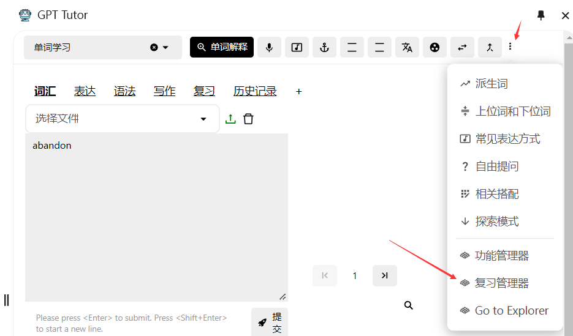

## Reviewing

GPT-Tutor provides two methods for reviewing:

1. Connect to Anki and add your materials there for review.
2. Use GPT-Tutor's built-in review feature. If you prefer reviewing on a mobile device, Anki is recommended. If you only need to review on a computer, GPT-Tutor's built-in feature is a good choice.

### Using Anki

1. Open Anki.

2. Select "Tools" in the top left, then click "Add-ons" (or press Ctrl + Shift + A to open Add-ons).

3. Click "Get Add-ons" and enter 2055492159 to download the AnkiConnect add-on.

4. After downloading, double-click to open AnkiConnect, set the apiKey to "Sol och skyar (Sun and Clouds), Op. 102: No. 5. Majsol ler, Maj (May Sun Smiles, May)" (include the double quotes), and set "webCorsOriginList" to "*".

[What is Anki?](https://sspai.com/post/65095)

#### How to Download Anki

To use the vocabulary memory feature, you need to download Anki for both PC and mobile.

[Anki for PC](https://apps.ankiweb.net/)

**Mainland China users** who cannot access or download can private message or ask in Telegram.

For mobile devices, search for Anki in your app store.

### Built-in Review Feature

#### 1. Open the Review Manager

#### 2. Select a Vocabulary Book to Study and Review

### 3. Set Review Intervals and Number of Words per Session

- The Ebbinghaus forgetting curve shows that long-term memory retention requires review at specific intervals. Anki uses this principle, and GPT-Tutor offers a similar method.

- GPT-Tutor not only provides standard review intervals but also allows for easy adjustments to fit individual memory cycles. You can adjust the review intervals to better suit your needs.

- After setting your review schedule, GPT-Tutor generates a study plan chart (see image). This chart calculates the time needed to complete the entire vocabulary book and the number of words to review daily based on your set intervals and word count per session.

