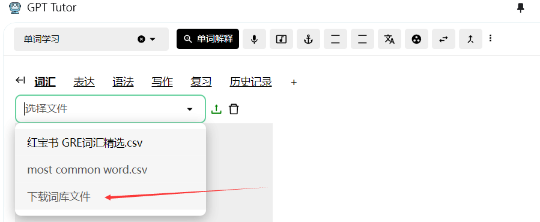
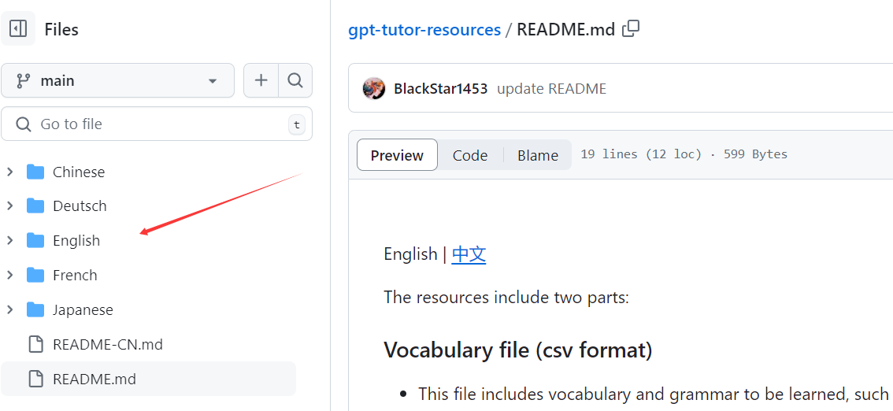
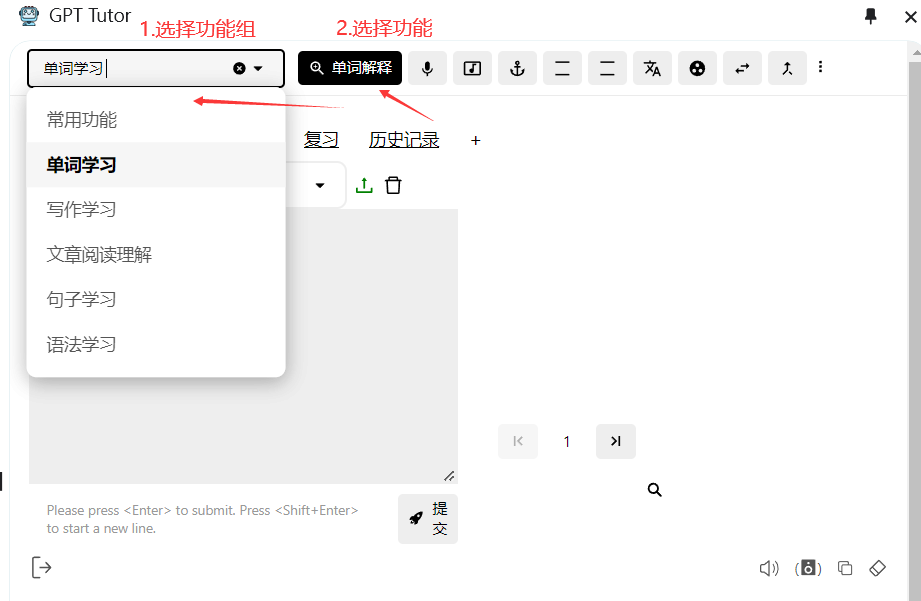
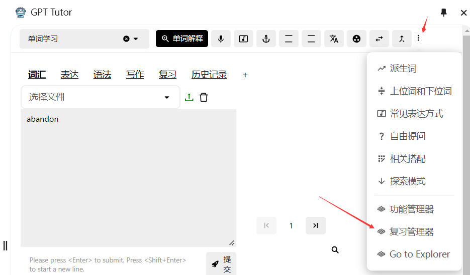
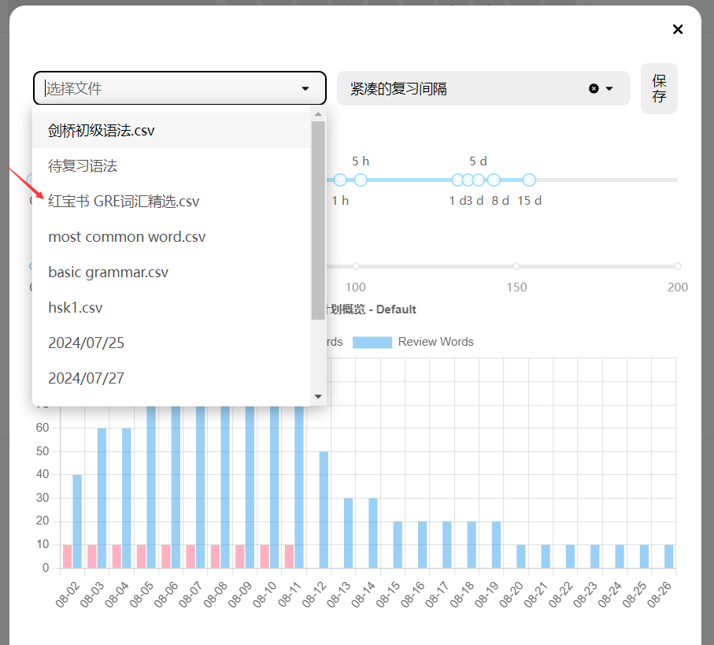

## Initial Setup

If you want to quickly set up and try the features of GPT-Tutor, you only need to complete these four settings:

### Language Settings

1. Adjust the language of GPT-Tutor to your native language.
2. Set the language you want to learn.

### Choose a Service Provider

When you first open GPT-Tutor, you need to set up the **Default Service Provider** ([default service provider](./main-explain/provider.md)) and **API Model** ([API model](./main-explain/APImodel.md)). If you can use ChatGPT normally, **ChatGPT Web** (free) is recommended.

If you are in an OpenAI-supported region: It is generally recommended to use the free and effective ChatGPT Web, in combination with a paid API from OpenAI, Gemini, or Claude as a backup.

If you are not in a supported region, such as Mainland China: It is recommended to choose the free Kimi+ChatGLM, with a paid API from Moonshot or DeepSeek as a backup.

#### Why also use a paid API?

Paid APIs offer better models, faster response times, and more stable usage. ChatGPT Web may become temporarily unavailable due to OpenAI's changes.

### Choose a Model

Different models may perform differently. It is usually recommended to use better models for complex grammar explanations and essay corrections. For example, in ChatGPT Web, the paid GPT-4 model can correctly explain the Chinese term "童养媳" (child bride), while the free GPT-3.5 interprets it as "daughter-in-law".

## More Complete Settings

To use GPT-Tutor for memorizing vocabulary and subsequent learning, more complete settings are needed.

### 1. Set TTS (How to Read Aloud)

[What is TTS?](./main-explain/tts.md)

If you are using ChatGPT Web, it is highly recommended to choose options marked with ChatGPT Web, such as Ember, Cove, Sky, as their readings are more realistic, smooth, and human-like.

If you are using EdgeTTS, you need to add a voice in Voice, like I have added Simplified Chinese here. You can also adjust the Rate and Volume to set reading speed and volume.

### 2. Download Vocabulary Books and Upload to GPT-Tutor

1. Click "Download Vocabulary Files" in GPT-Tutor, which will redirect you to [the webpage for downloading vocabulary books](https://github.com/GPT-language/gpt-tutor-resources).

2. Find and download the corresponding vocabulary book for your language.

3. Upload it to GPT-Tutor, like here I downloaded and uploaded "Red Treasure Book GRE".

### 3. Choose Function Groups and Functions

[What are Functions and Function Groups?](./main-explain/prompts.md)

You can create, update, and delete all [functions](./main-explain/prompts.md) in the Action Manager ([action manager](./main-explain/actionManager.md)).

## Review Function Settings

GPT-Tutor offers two methods for reviewing vocabulary and other content: (1) connect to Anki and complete reviews by adding to Anki, (2) use GPT-Tutor's built-in review function. If you need to complete reviews on mobile devices, it is recommended to use Anki; if you only need to complete reviews on a computer, then GPT-Tutor's built-in review function is suggested.

### Anki Settings

1. Open Anki.
2. Choose Tools in the top left corner, then click Add-ons. (Or press Ctrl + Shift + A to open Add-ons directly).
3. Click Get Add-ons, enter 2055492159 to download the AnkiConnect plugin.
4. After downloading, double-click to open AnkiConnect, set the apiKey as "Sol och skyar (Sun and Clouds), Op. 102: No. 5. Majsol ler, Maj (May Sun Smiles, May)" (include the quotes), then set "webCorsOriginList" to "*".

[What is Anki?](https://sspai.com/post/65095)

#### How to Download Anki
To use the word memorization feature, you also need to download Anki for both PC and mobile.

[PC version Anki](https://apps.ankiweb.net/)

**Users in Mainland China** who cannot open or download please send a private message or ask on Telegram.

Search the app store for the mobile version.

### GPT-Tutor Built-In Review Function

#### 1. Open the Review Manager

#### 2. Select a vocabulary book to learn and review

#### 3. Set the review interval and the number of words to learn each time

- The Ebbinghaus forgetting curve proves that to remember something long-term, it needs to be reviewed at specific intervals. Anki conducts reviews based on this curve, and GPT-Tutor offers a similar method of review.

- Besides providing standard memory cycles, GPT-Tutor allows for quick and easy adjustment of these cycles because each person's memory cycle might differ. You can adjust your memory cycle by changing the review intervals.

- After setting the memory cycle, GPT-Tutor will draw a study plan chart (as shown). Based on the current cycle and the number of words learned each session, the chart calculates the time needed to complete the learning and review of the entire vocabulary book and the number of words needed to review each day.

