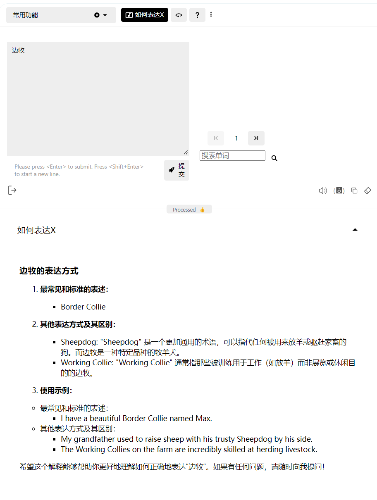
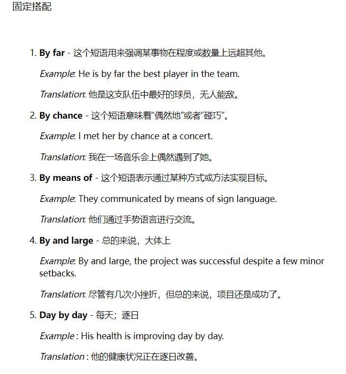
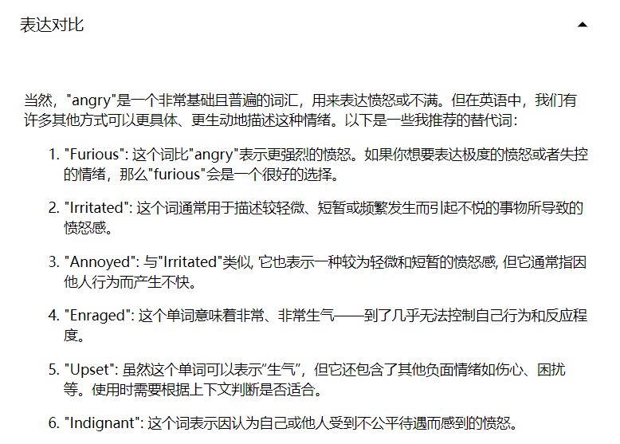

# 如何使用AI来帮助你永远记住一个单词

推荐你结合这个视频阅读：[如何永远记住一个单词](https://www.bilibili.com/festival/jzj2023?bvid=BV1ns4y1A7fj&spm_id_from=333.337.search-card.all.click)

视频中提到了单词学习时存在的三个难题：

1. 任意符号难题
2. 宽度难题
3. 深度难题

这三个难题又很好地解释了我们学习外语词汇时的两个终极问题：

1. **为什么我们记不住单词**

2. 为什么我们**记住**了那么多单词，在阅读和写作时还是**没有用**

本篇文章的目的便是解释如何使用AI来解决这三个难题，从而解决这两个终极问题。

## 任意符号难题

> “任意符号难题”是指语言符号（如词汇）的形式与其意义之间的关系是任意的，也就是说，这种关系并没有内在的逻辑或自然的联系。在英语中，“dog”这个词的形式与它指代的动物（狗）之间没有自然的联系。这种联系是约定俗成的，而其他语言可能用不同的形式来表示相同的意义，比如中文的“狗”或法语的“chien”也是如此。

对于母语使用者，从婴儿开始就需要同时学习词汇的发音、拼写和其所代表的概念、意义，而对于外语学习者来说，只需要学另一门语言中指代符号即可，因为我们在学习我们的母语时习得了大部分事物的形象、概念和含义。比如我们已经知道了“狗”这个动物是什么，有了”狗“的形象和概念，接下来我们学习的只是在另一门外语中如何表示它。

这实际上是一个**优势**，我们不需要再去重新观察、体验和理解什么是“狗”，这也是视频里所提到的**常识优势（Word Knowledge Advantage）**。这个优势能够有效帮助我们的单词学习，但我们在学习中却没有利用好这个优势，因为我们**没有建立起外语单词和我们已有的常识的连接**。

### 建立连接

学习一门外语，本质可以理解为将我们已经学习到的关于狗的概念和含义，与外语中的“狗”的发音、拼写**建立连接**，而我们**建立连接的方式和方向**决定了这种连接是否稳固和有效。

我们通常是这样学习dog这个单词的：

**先学习单词dog，然后查阅教材或词典知道它是“狗”的意思。**

这样的学习方式使得我们的连接是从一个完全陌生的符号“dog”开始的，然后通向我们熟悉的母语中的符号“狗”，然后借助常识优势来直接理解dog是什么。这里建立的是一个由“dog”→“狗”的**一对一单线连接**，但这也许并不是一个**合适的连接方式和连接方向**。

学习/记忆本质上也是建立一种**新的连接（神经突触）**，而一个连接如果要从完全陌生的东西开始建立，难度要高上许多。回想一下，对比在我们已经熟悉的学科中学习新的内容和在完全陌生的学科中学习新的内容，哪一个要更简单？即使从情绪上来说，我们对完全陌生的东西也有一种本能的抵触。

当然，也许你会觉得，第一次学习当然是陌生的，所以我们才需要学习啊？——但事实并非如此，利用好之前所说的**常识优势**，我们不需要完全从“陌生”开始，我们已经有了关于“狗”的概念和含义。既然从陌生→熟悉的建立方式要更加困难，那为什么我们不反过来，借助已有的常识优势，**从熟悉的东西开始建立连接**呢？

### 从熟悉的地方开始建立连接

你有没有想过这样一种可能：英语教材书应该翻转顺序，将单词的意思放在左侧，将对应的英语单词放在右侧。

这样当我们学习单词时，我们先看见了单词的意思，比如我们先看见dog的意思是“狗”，想起“狗”的概念和形象，想起了家里正酣睡的小狗，路上看到的流浪狗，想起了史努比···然后你心里有了疑惑，如何用英语来称呼狗呢？这时候你看见了“dog”，这时候dog就与你之前许许多多的联想联系在了一起。

你看见其中的区别了吗？在此之间我们建立的连接是两种能指之间的连接，是“dog”和“狗”之间的**单线连接**，而现在我们建立的是“狗”这个概念和形象、家里正酣睡的小狗、路上看到的流浪狗···许许多多事物和“dog”之间的**多线连接**，用一根线来连接和许许多多根线来连接，哪个更稳固？答案显而易见。

而在复习时两者的区别则会更加明显。建立这种多线连接后，每当你看见线的这一端——在路上看见流浪狗，回家看见家里的小狗，在动画片/电影中看见狗，又或者只是这些概念出现在你的脑海时，你都会无意识想起线的另一端——重复对应的英语单词dog，每一次重复都相当于一次“无痛”的复习。你会发现这样来学习和记忆单词既轻松，也更有效。

### 母语者的学习方式

每一个母语使用者，即使是最“没有文化”的母语使用者，其掌握的词汇量也往往比绝大多数外语学习者要多。为什么？母语使用者能够记住，还能正确使用那么多单词，而外语学习者却不能？问题出在外语学习者的学习方式上。

一个母语学习者通常是怎样来学习和记忆一个单词的？假设有这样一个母语学习者（下文简称为A），他有可能是这样来学习和了解到chair（椅子）这个单词的：

- 在A很小的时候，要吃晚饭了，母亲把他放在椅子上会说“宝宝乖乖，坐在chair上，妈妈喂你”。

- 等A再大一些会说话了，可能会指着一把黄色的chair问，“妈妈那是什么？”，妈妈会告诉她“那是一把黄色的High chair（一种为婴儿或幼儿设计的高椅，用于喂食），你小时候很喜欢坐在上面。”

- 当看到父亲在房间里办公，A可能会跑进去指着父亲坐的椅子问，“为什么你的椅子比我的高上好多？还可以变高变矮？”父亲告诉他这是Office chair（用于办公室的椅子，通常设计得比较舒适且可以调节高度），是工作专用的椅子。

- “那dad你是在做什么工作呢？”父亲回答，“我是一家公司的Chair of the Board（董事会主席）...”

像这样的场景还会在A的生活中出现许多次。你会发现，A对chair的学习和复习不是建立在一张左边写着“chair”，右边写着“chair是有着四条腿的家具”的白纸上，而是建立在视觉（看见不同颜色、不同形状的椅子）、听觉（不同的人使用不同的声调重复这个单词），不同语境下的多线联系上。这样建立起来的联系是如此稳固而有效，如同一张严密的蛛网支撑起A对chair这个单词的理解和使用。

这也是视频中所提到的**语境式学习(Contextual Learning)**，这种学习方式将是一种十分有效的学习方法，只是这种方法应用起来太过困难所以一直没有得到推广，直到AI的出现。

> 语境式学习（Contextual Learning）是一种教育和学习方法，强调在特定的语境或背景中学习新知识，而不仅仅是孤立地学习概念。这种方法通过将学习内容与实际应用或现实世界中的情境相结合，帮助学习者更好地理解和记忆信息。

### GPT-Tutor如何帮助你

GPT-Tutor中有多种功能可以帮助你从熟悉的地方开始建立连接，实践语境式学习，以下几种只是示例之一。

1. 如何表达X

你看见你家的小狗趴在你面前酣睡，你想到它是一只边牧，你想知道“边牧”是怎样用英语表达的，那么你可以选择“如何表达X”这个功能，然后输入“边牧”：

晚上回到家，还有好多事情要做，你觉得“事情好多啊”，你想知道“事情好多”如何用英语表达：

2. 场景表达

你也可以输入一个你熟悉的场景，来获取该场景中相关事物的英语表达。比如输入卧室，你会获得以下答案：

### 自定义词书

**高度自定义**也是GPT-Tutor的重要特性之一，你可以不依靠所谓权威的词书（比如红宝书、蓝宝书），而是通过你自己的学科、职业、爱好等等来创建你自己的词书。

比如你可以将你一天中想要知道的事物、概念和场景都记在备忘录上，然后使用ChatGPT或其它工具帮你整理为一个csv格式的词书（后续这个功能将能够直接在GPT-Tutor中实现），然后导入到GPT-Tutor中。

#### 示例

假设你你一天中想要知道的事物、概念和场景是这样的：

1. 起床气。
2. 自行车。
3. 学校。
4. 体育课。
5. 累。
6. 作业写不完。
7. 电影院。

那么复制这个列表到ChatGPT，让它帮你整理为一个csv文件（如图）：

下载该文件，然后你就会获得一个csv格式的文件列表：

我们导入到GPT-Tutor中，整个列表就会显示在GPT-Tutor中了：

让我们试下看效果怎样：

Bravo！效果好极了！

### 复习

你可以使用著名的记忆软件anki，或者使用GPT-Tutor内置的复习机制来完成复习，具体请查看[如何复习](/docs/problem/review.md)

## 宽度问题

宽度问题指在一个词汇在不同语境下有着完全不同的含义，如果我们不了解对应的语境很难理解该词汇准确的含义。

### 多义性

宽度问题由多个因素造成，第一个就是单词的多义性（Polysemy）。一个单词可能有多个含义，而且越是常见的单词就在不同的语境下有着更丰富多样的含义，以视频中提到的by举例：

通常我们刚刚开始学这个单词时只会学“在···旁边”的含义，而在这个句子中by有五种含义：

- I found the book by Dickens by chance by the tree and shall return it by mail by Friday.（我偶然在树边发现这本由狄更斯写的书籍，我将在星期五通过邮箱来将它归还）

这里的第一个by是“由某人创作”的意思，第二个by是“在某种情况下”，第三个by是“在···旁边”，第四个by是“通过···方式”，第五个by是“在···时候”。

如果你只知道by“在···旁边”的含义，那你不可能理解这段句子的含义。

在AI出现之前，我们如果要通过阅读来了解by的五种含义，我们可能需要通过查阅教材、词典或搜索引擎才能充分理解by的含义和使用，而现在只需要点击“单词解释”的功能，然后输入by就能获得结果，不仅包括含义的解释，还有对应语境和例句：

### 多词组合语（固定搭配）

造成宽度问题的另一个因素是，一个词汇并不只是单独起作用，它还会与其它词共同构成固定搭配，而大多数时候我们无法通过短语里面的单词来推出这个固定搭配的含义。比如同样以by为例：

- by the way（顺便说一下）
- by all means （务必，尽一切办法）
- by and large （总体而言）

你可以遮住右边的含义，然后尝试看在自己即使已经知道了by的五种含义的情况下，能否推断出以上固定搭配的含义。

AI也能够迅速帮助你学习与by相关的固定搭配：

### GPT-Tutor如何解决宽度问题

如果你打算使用**词条式学习**的方法来学习单词，那么GPT-Tutor使用一系列功能来帮助你延申该单词的宽度，这样你在学习by时学习到的不只是“在···旁边”的含义，而是所有常见含义和常用词语搭配、乃至近义词、反义词等等相关信息。

> 词条式学习（entry-based learning），有时也称为“条目式学习”或“词汇条目学习”，是一种学习方法，通常用于语言学习和词汇扩展。它的核心思想是通过系统地学习单个词汇项（词条）及其相关信息，以增强对语言的理解和运用能力。

但如果按照词条式学习的方法存在一个很明显的弊端：单纯通过死记来记住大量单词的不同意思、固定搭配乃至更多的其它相关内容，可能相当于用勺子来抽干海洋，特别是对于记忆力不算好的人来说。那么我们就需要之前提到过的另一种方法：**语境式学习**。

### 语境式学习

在视频里博主推荐通过**语境式学习**——更准确来说，通过阅读来解决这个问题。因为在阅读中一个单词是在充分的语境里出现的，它不再是一个孤立的小岛，而是一张充满连接的语境网络中的一个节点，而这张网络会共同支持起我们对这个单词节点的学习。这里的原理其实和我之前提到的dog一样，我们通过已有的连接来帮助你建立新的连接，然后这些连接会互相支持，互相强化，这样整张记忆网络就会越来越稳固。

毫无疑问这当然是一个更有效的方法，而且可能也是过去最有效的方法之一，但，**大人时代变了**，有了AI，通过GPT-Tutor，我们可以实现更高效的方法。

#### 制造语境 

语境式学习的方法是正确的，但通过阅读来实现语境式学习的方法则存在几个明显缺点：（1）不能听力发音和听力（2）太过宽泛，导致效率不高（3）不是每个人都适合阅读

（1）能通过听有声书来解决，有许多app已经有相当程度的解决方法，但是（2）、（3）的问题是无法解决的，这是阅读这种方式本身存在的缺陷。

既然我们阅读是为了获得一个语境，并且在语境中学习词汇的含义，那么如果我们能够直接让AI来生成一个词汇的语境，那么我们是不是就不需要阅读了呢？我们试试看：

这还只是在没有调整提示词的情况下，效果已经相当之好。AI相当于替你直接从书籍中把包含by的语句摘抄了出来，这样你不再需要通过阅读来在上下文中了解by的含义，而是直接获取对应的语境来学习对应的by的含义。

#### 制造更熟悉的语境

AI做的还能更多，它不仅能够制造语境，还能根据你的职业、你的年龄和你设置的场景等等设置来帮助设置你更熟悉的语境，而更熟悉的语境能够更有效地帮助我们建立起与陌生词汇的联系和后续复习。

比如你是一位上班族，常常需要乘坐地铁，那么你就把你的场景设置在地铁，这样每当你乘坐地铁时都可能回想起那个语境和其中学习的词汇，在无痛中完成复习。

## 深度问题

单词的深度问题很好理解，表达同样的一种情绪，比如愤怒，可能在另一个。我们知道表达生气有angry和enraged，老师和我们说enraged是高级词汇，于是我们在想获得高分时就一律使用高级词汇enraged，而这实际上分会更低。因为我们并没有理解真正两者含义和使用上的区别。如果你使用angry那么可能是正确的只是不够有“文采”，但你使用enraged则可能完全是使用错误。实际上要表达angry这个情绪，还有以上词：······，其中每个词都表达愤怒，但是表达的是在不同情况下不同程度的愤怒，所谓写作水平高的标准之一，就是能够掌握一个词的深度并正确运用。

在AI出现之前，学习这么多单词和相似词之间的区别过于困难，基本只能通过询问母语者或者自己仔细查询词典对比，我就曾经多次在Reddit上询问关于某两个词之间的细微区别，而在GPT-Tutor出现之后，你只需要使用“表达对比“这个功能：

就像在解决宽度问题时一样，在解决深度问题时也可以使用GPT-Tutor来实现语境式学习，通过制造不同的语境来更好地理解不同词汇之间的使用。具体操作和之前相同，这里不再进行演示。

## 后续

限于篇幅，这篇文章只是解释了GPT-Tutor学习单词的思路和部分功能，接下来我会在下一篇文章介绍更详细和全面的使用。

如果对你有帮助，你可以在[爱发电](https://afdian.com/a/zy1999)或者[Patreon](https://www.patreon.com/yaoyaoyao/posts)上支持我的创作。