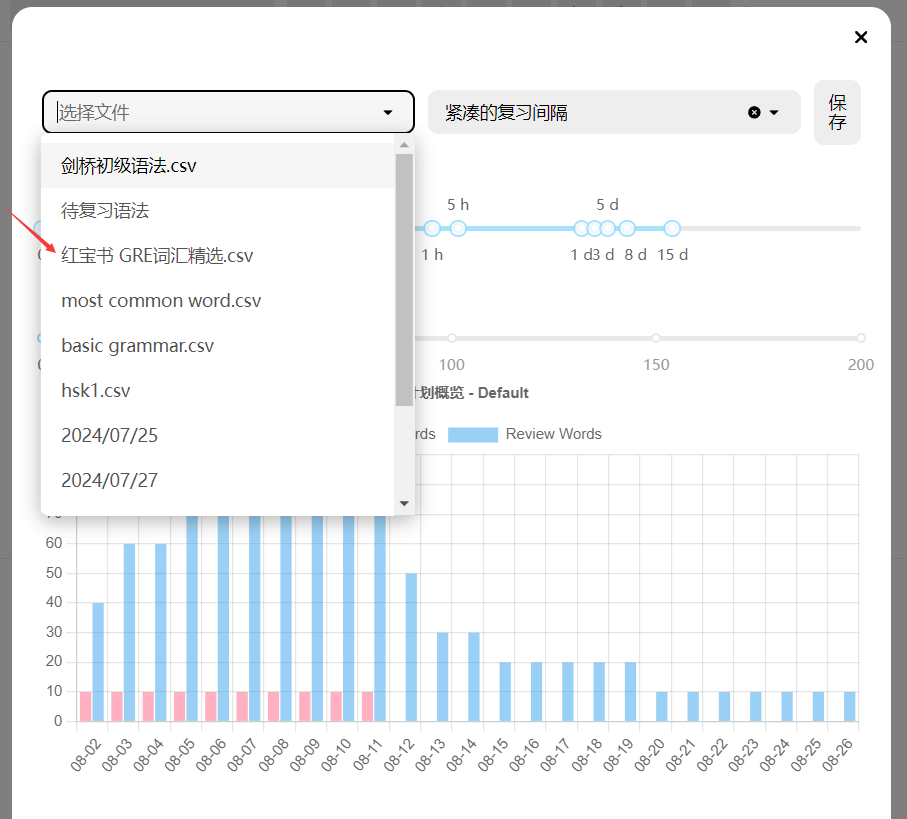

## 主页面功能

### 回答区域

红色方框内的功能分别是：1.重新生成答案 2.朗读 3.复制 4.添加到anki 5.对当前的回答不满意。

然后还有下方的选项：更多解释、继续、添加到复习。

接下来我会做出解释。

### 添加到anki

将当前回答添加到**已经连接好**的anki，在anki中完成复习。

### 对当前的回答不满意

当你觉得当前回答不正确或者不足够好时，你可以点击该选项，然后按照里面的教程进行设置来获得更好的回答。

### 更多解释
如果你为当前使用的功能设置了[辅助功能]，那么你在点击更多解释后它们会显示在列表中，你可以直接选择然后使用，不需要返回到顶部来重新输入。

### 继续

点击后直接按照顺序使用功能选择栏中的下一个功能，不需要返回到顶部。

### 添加到复习

GPT-Tutor提供两种复习方式：

1. 连接anki并添加到anki中完成复习 

2. 使用GPT-Tutor内置的复习功能。如果你需要在移动端完成复习，那么建议使用anki，如果你只需要在电脑上完成复习，那么建议使用GPT-Tutor内置的复习功能。

#### Anki设置

1.打开Anki。

2.左上角选择工具，然后点击插件。（或者直接Ctrl + Shift +A打开插件）。

3.点击获取插件，输入2055492159下载插件AnkiConnect。

4.下载好后双击打开AnkiConnect，将apiKey设置为"Sol och skyar (Sun and Clouds), Op. 102:No. 5. Majsol ler, Maj (May Sun Smiles, May)"（记得带双引号），然后设置 "webCorsOriginList"为"*"。

[Anki是什么？](https://sspai.com/post/65095)

##### 如何下载Anki
想要使用单词记忆功能，你还需要下载PC端和移动端的Anki。

[PC端Anki](https://apps.ankiweb.net/)

**中国大陆用户**无法打开或下载则请私信或在Telegram中询问。

移动端搜索应用商店即可。

#### GPT-Tutor内置复习功能

##### 1.打开复习管理器

##### 2.选择一本需要学习和复习的词书

#### 3.设置复习间隔和每次学习单词的数量

- 艾宾浩斯遗忘曲线证明人想要长期记忆一件事物，需要按照一定的记忆周期来进行复习巩固，anki中便是按照这个曲线来进行复习，GPT-Tutor中提供了与anki类似的复习方法。

- GPT-Tutor除了提供了标准的记忆周期外，考虑到可能每个人的记忆周期不完全相同，所以提供了方便且快捷的调整方法，你可以通过调整复习间隔来进行记忆周期进行调整。

- 完成记忆周期的设置后，GPT-Tutor会为你绘制一张学习计划图表（如图），按照当前周期和每次学习单词数量，图表会计算出完成整个词书的学习和复习所需要的时间，以及每日需要复习的单词数量。

