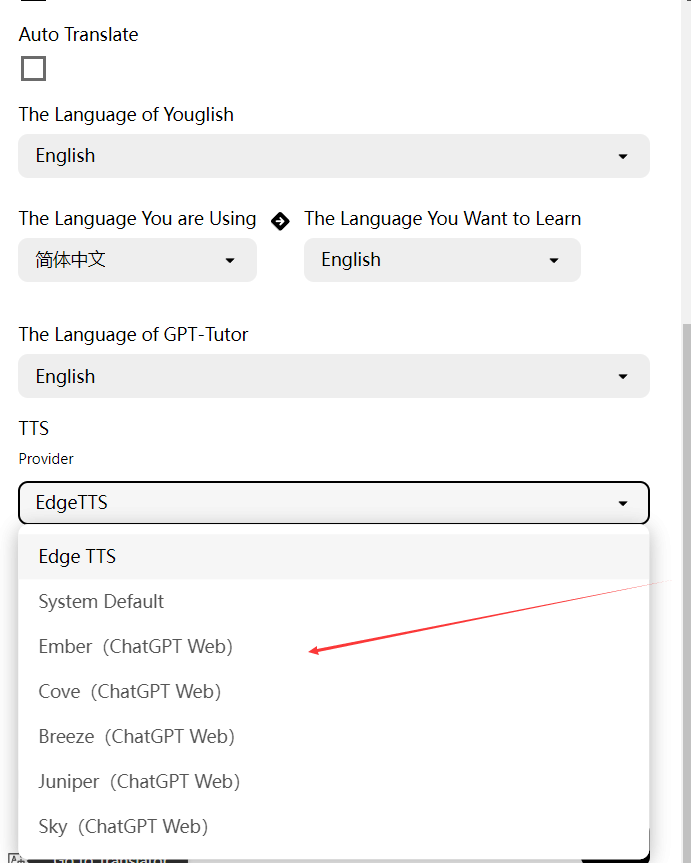

## 发音设置

发音设置即设置GPT-Tutor中的单词、句子和给出的回答如何发音的设置，GPT-Tutor中给出了三种发音方式：Youglish、EdgeTTS、ChatGPT（Web），请根据需要进行选择。

### Youglish设置

通常设置为和你想要学习的语言相同。在设置完成后，你能够点击这个音响，来使用Youglish查看该单词在**YouTube**（也就是说你需要能够连接到YouTube才能使用）中的真人发音。

### EdgeTTS设置

默认的发音设置。EdgeTTS支持多种语言，而且可以调整音量和速度。你需要选择TTS Provider为EdgeTTS，然后在Voice中添加声音，比如这里我添加了简体中文。通过调整Rate和Volume来设置阅读速度和音量。

### ChatGPT Web

如果你在使用ChatGPT Web，那么非常建议你选择这里带有ChatGPT Web标记的选择，比如Ember，Cove，Sky，他们的朗读更加真实、流畅、人性化。

