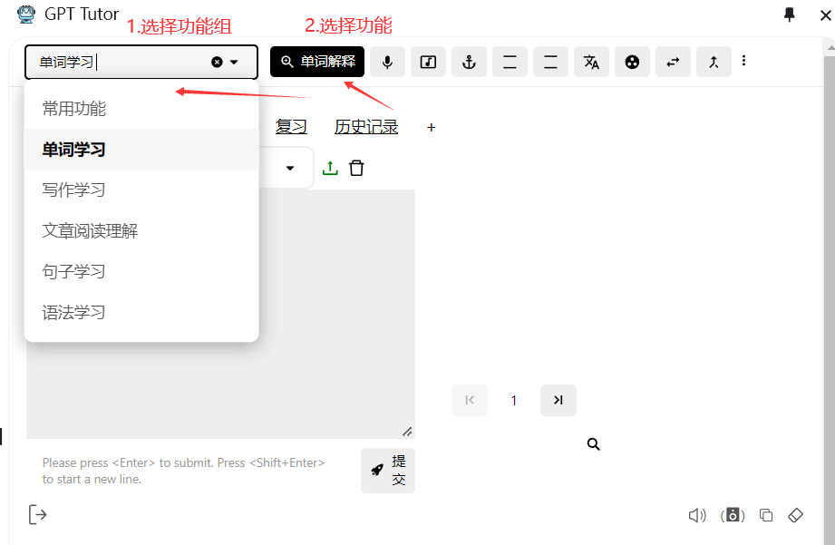

如果你想要快速完成设置来试用gpt-tutor的相关功能，那么你只需要完成这四个设置：

### 使用语言设置

1.调整gpt-tutor使用的语言为你的母语

2.设置你想要学习的语言

### 选择服务提供商

在初次打开GPT-Tutor时，你需要设置**Default Service Provider**（[默认服务提供商](./main-explain/provider.md)）和**API Model**（[API模型](./main-explain/APImodel.md)），如果你能够正常使用ChatGPT，这里推荐使用**ChatGPT Web**（免费）。

如果你在OpenAI支持的地区：通常建议选择免费且效果较好的ChatGPT Web，同时搭配OpenAI或Gemini、Claude的付费API作为备用。

如果你不在支持地区，比如中国大陆：那么建议你选择免费的Kimi+ChatGLM，同时搭配Moonshot或DeepSeek的付费API作为备用。

#### 为什么还需要搭配一个付费API？

付费API有着更好的模型，更快的响应速度，使用也更稳定。ChatGPT Web随时可能因为OpenAI的修改导致暂时无法使用。

### 选择模型

不同的模型使用效果可能差异较大，通常建议在复杂语法讲解、作文修改时使用更好的模型。比如在ChatGPT Web中，付费的GPT-4模型能够正确解释“童养媳”这个中文中的特殊词，而免费的GPT-3.5却会把这个词理解为儿媳的意思。

## 更完整的设置

想要使用gpt-tutor来记忆单词和后续学习，需要完成更完整的设置。

### 1.设置TTS（如何朗读）

[什么是TTS？](./main-explain/tts.md)

如果你在使用ChatGPT Web，那么非常建议你选择这里带有ChatGPT Web标记的选择，比如Ember，Cove，Sky，他们的朗读更加真实、流程、人性化。

如果你使用的是EdgeTTS，那么你需要在Voice中添加声音，比如这里我添加了简体中文。你还可以调整Rate和Volume来设置阅读速度和音量。

### 2.下载词书并上传到GPT-Tutor

1. 点击GPT-Tutor中的“下载词库文件”，然后会调转到[下载词书的网页](https://github.com/GPT-language/gpt-tutor-resources)中

2. 找到对应语言的对应词书下载

3. 上传到GPT-Tutor，比如这里我下载并上传了“红宝书GRE”。

### 3.选择功能组和功能

[什么是功能和功能组](./main-explain/prompts.md)

你可以在Action Manager（[动作管理器](./main-explain/actionManager.md)）中创建、更新、删除所有[功能](./main-explain/prompts.md)。

## 复习功能设置

GPT-Tutor提供两种复习单词和其它内容的方式：（1）连接anki并添加到anki中完成复习 （2）使用GPT-Tutor内置的复习功能。如果你需要在移动端完成复习，那么建议使用anki，如果你只需要在电脑上完成复习，那么建议使用GPT-Tutor内置的复习功能。

### Anki设置

1.打开Anki。

2.左上角选择工具，然后点击插件。（或者直接Ctrl + Shift +A打开插件）。

3.点击获取插件，输入2055492159下载插件AnkiConnect。

4.下载好后双击打开AnkiConnect，将apiKey设置为"Sol och skyar (Sun and Clouds), Op. 102:No. 5. Majsol ler, Maj (May Sun Smiles, May)"（记得带双引号），然后设置 "webCorsOriginList"为"*"。

[Anki是什么？](https://sspai.com/post/65095)

#### 如何下载Anki
想要使用单词记忆功能，你还需要下载PC端和移动端的Anki。

[PC端Anki](https://apps.ankiweb.net/)

**中国大陆用户**无法打开或下载则请私信或在Telegram中询问。

移动端搜索应用商店即可。

### GPT-Tutor内置复习功能

#### 1.打开复习管理器

#### 2.选择一本需要学习和复习的词书

#### 3.设置复习间隔和每次学习单词的数量

- 艾宾浩斯遗忘曲线证明人想要长期记忆一件事物，需要按照一定的记忆周期来进行复习巩固，anki中便是按照这个曲线来进行复习，GPT-Tutor中提供了与anki类似的复习方法。

- GPT-Tutor除了提供了标准的记忆周期外，考虑到可能每个人的记忆周期不完全相同，所以提供了方便且快捷的调整方法，你可以通过调整复习间隔来进行记忆周期进行调整。

- 完成记忆周期的设置后，GPT-Tutor会为你绘制一张学习计划图表（如图），按照当前周期和每次学习单词数量，图表会计算出完成整个词书的学习和复习所需要的时间，以及每日需要复习的单词数量。

