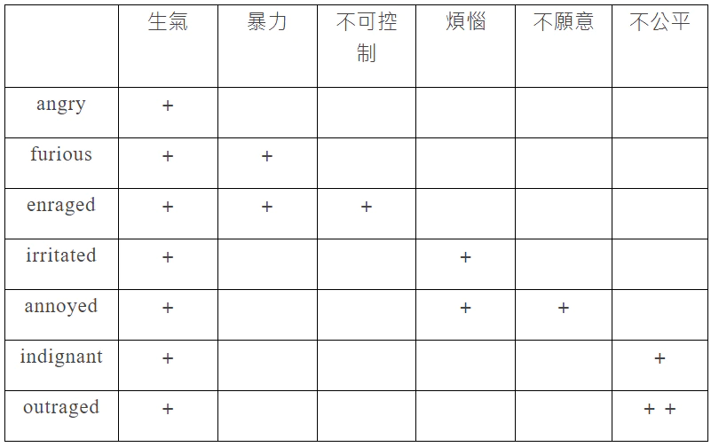

**建议通过[少数派](https://sspai.com/post/91178)来查看该文章，排版会更好。**

# 引言

如何使用AI来永远记住一个词这个问题可以划分为两个问题：

1. 永远记住一个单词的方法是什么
2. 如何使用AI来实现这个方法

而其中问题1又可以划分为两部分：（1）记不住的原因（2）解决方法。所以本文总共会分成三大部分，一、二解释为什么记不住单词以及如何记住，最后一个部分则解释如何实现AI来实现这个方法。

### 直接参考来源

> 以下内容基于该视频：[如何永远记住一个单词](https://www.bilibili.com/festival/jzj2023?bvid=BV1ns4y1A7fj)。非常建议结合该视频进行阅读。

## 两个问题和三个难题

在学习单词时你也许问过自己这两个**终极问题**：

1. 为什么我记不住单词

2. 为什么我记住了那么多单词，在阅读和写作时还是没有用

你也许会觉得是自己没有语言天赋，是自己记忆力不好，是自己实际上没“记住”，或者是记住了又忘了······但答案可能很简单，并非是你的天赋或能力出现了问题，而是单词本身比你想象中要复杂，学习单词这件事也比你想象中要复杂。

学习单词时存在的所有难题最终都可以归类到三个难题中：**任意符合难题、宽度难题、深度难题**。任意符合难题解释了为什么记不住，而宽度、深度难题则解释了为什么记不住以及为什么我们记住了还是没有用。

## 任意符号难题

> “任意符号难题”是指语言符号（如词汇）的形式与其意义之间的关系是任意的，也就是说，这种关系并没有内在的逻辑或自然的联系。在英语中，“dog”这个词的形式与它指代的动物（狗）之间没有自然的联系。这种联系是约定俗成的，而其他语言可能用不同的形式来表示相同的意义，比如中文的“狗”或法语的“chien”也是如此。

任意符号难题告诉我们，即使我们已经了解了“狗”的形象和概念，这对我们学习英语中的dog，法语中的chien也毫无帮助，因为用来表示形象和概念的符号是任意的，和它的形象、概念没有任何关联。我们在新学习一门外语时完成是从一个个陌生符号开始学起的，无法和我们的日常生活所看见的形象和理解的概念产生关联，这自然而然会加大我们学习词汇的难度。

假如词汇的形式与其意义之间的关系不是任意的，是有联系的呢？甲骨文就是这样的。在甲骨文中我们对形象的认识就能够有效帮助我们学习这个单词，比如图中的“日”和“月”，如果我们认识现实中的太阳和月亮，我们很轻松就能理解并掌握这两个甲骨文，即使我们从来没有接触过这门文字。

## 宽度问题

宽度问题指在一个词汇在不同语境下有着完全不同的含义，如果我们不了解对应的语境很难理解该词汇准确的含义。

### 多义性

宽度问题由多个因素造成，第一个就是单词的多义性（Polysemy）。一个单词可能有多个含义，而且越是常见的单词就在不同的语境下有着更丰富多样的含义，以视频中提到的by举例：

通常我们刚刚开始学这个单词时只会学“在···旁边”的含义，而在这个句子中by有五种含义：

- I found the book by Dickens by chance by the tree and shall return it by mail by Friday.（我偶然在树边发现这本由狄更斯写的书籍，我将在星期五通过邮箱来将它归还）

这里的第一个by是“由某人创作”的意思，第二个by是“在某种情况下”，第三个by是“在···旁边”，第四个by是“通过···方式”，第五个by是“在···时候”。

如果你只知道by“在···旁边”的含义，那你不可能理解这段句子的含义。

在AI出现之前，我们如果要通过阅读来了解by的五种含义，我们可能需要通过查阅教材、词典或搜索引擎才能充分理解by的含义和使用，而现在只需要点击“单词解释”的功能，然后输入by就能获得结果，不仅包括含义的解释，还有对应语境和例句：

### 多词组合语（固定搭配）

造成宽度问题的另一个因素是，一个词汇并不只是单独起作用，它还会与其它词共同构成固定搭配，而大多数时候我们无法通过短语里面的单词来推出这个固定搭配的含义。比如同样以by为例：

- by the way（顺便说一下）
- by all means （务必，尽一切办法）
- by and large （总体而言）

你可以遮住右边的含义，然后尝试看在自己即使已经知道了by的五种含义的情况下，能否推断出以上固定搭配的含义。

## 深度问题

单词的深度难题很好理解，我们可能都在初学词汇时遇到过这个难题。

表达同样的一种情绪可能在另一门外语中有很多种表达，比如愤怒，在不同情景、不同语境下表达不同程度的愤怒使用的是不同的英语词汇，作为初学者很难理解这些词汇之间的使用和细微差别。

在高中的时候我们就可能知道就已经知道表达生气这个情绪可以有angry和enraged两个单词，然后老师和我们说enraged是高级词汇，于是我们在写作文时就不顾语境一律使用高级词汇enraged，最后却可能导致分数更低，因为我们并没有理解真正两者含义和使用上的区别。

> 根据程度的不同，表达生气情绪的单词有Annoyed、Irritated、Angry、Aggravated、Furious、Incensed、Enraged、Livid、Outraged、Seething······

在一般情况下，如果你使用angry可能都是正确的，只是不够有“文采”，但你使用enraged则可能完全是使用错误，因为enraged表达的是“暴怒”，而可能在那段句子中你表达的只是天气不好，有点懊恼而已。

所谓写作水平的重要标准之一，就是能够掌握这些不同的词汇并在合适的情况下使用，而这对于初学者相当困难，毕竟只是学习happy、angry、sad这些一般词汇就够我们喝一壶了，谁还顾得上这里的每一种情绪，根据情绪强烈程度不同，可能还有十几、二十多个不同的词汇可以表达呢？

像angry和enraged的区别还相对比较容易区分，因为两者愤怒的程度相差较大，但如果问你enraged和outraged的区别呢？两者在程度上没有区别，都是表达强烈的愤怒——这个答案基本上只有母语使用者才能告诉你，enraged通常就是用来表达强烈的愤怒，而outraged 则更常用于表达对公众事件或道德问题的强烈愤怒，是一种更外向的社会性愤怒。

大多数时候我们找不到像以上列表中这种详细且清晰的解释。如果是一些常见的我们还能问老师，还能查教材书、搜索引擎，更复杂的就无能为力了，你只能自己询问母语者或者自己仔细查询词典对比，我就曾经多次在Reddit上询问并得到母语者的帮助。

词汇学习的所有难题，最后几乎都可以归结到这三个难题上。这三个问题是学习词汇路上的三座大山，想要学好词汇唯有找到解决这三个难题的办法。