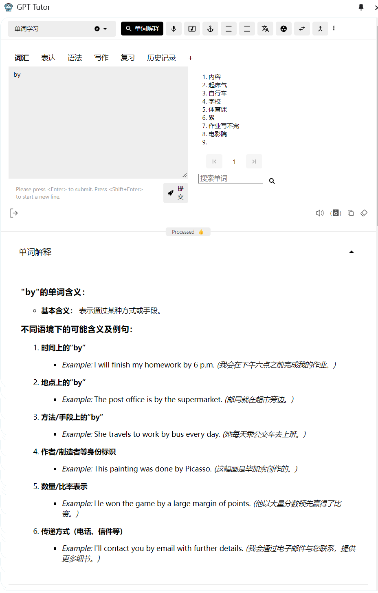
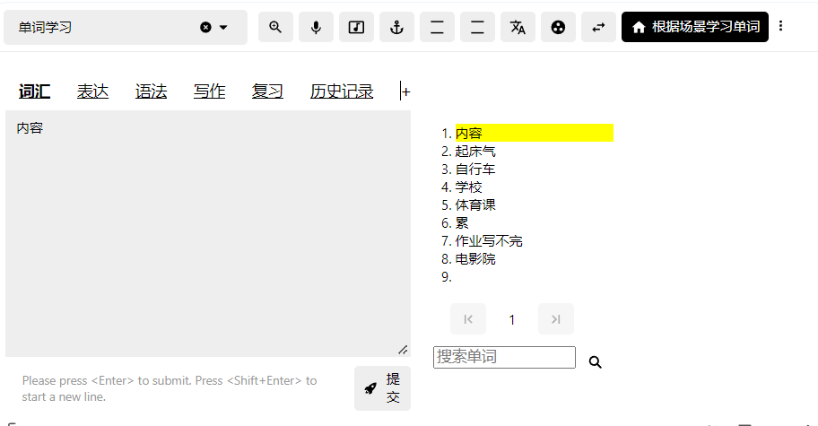
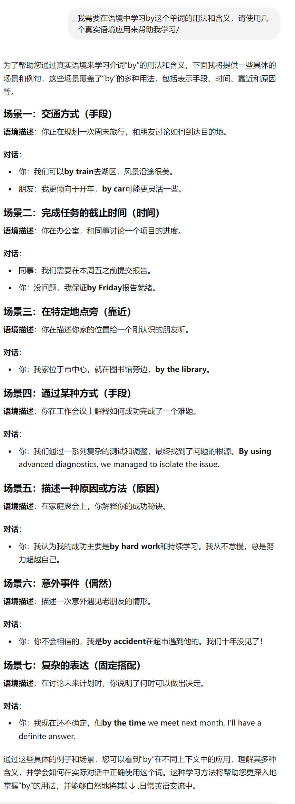

# 引言

如何使用AI来永远记住一个词这个问题可以划分为两个问题：

1. 永远记住一个单词的方法是什么
2. 如何使用AI来实现这个方法
而
其中问题1又可以划分为两部分：（1）记不住的原因（2）解决方法。所以本文总共会分成三大部分，一、二解释为什么记不住单词以及如何记住，最后一个部分则解释如何实现AI来实现这个方法。

推荐你结合这个视频阅读：[如何永远记住一个单词](https://www.bilibili.com/festival/jzj2023?bvid=BV1ns4y1A7fj&spm_id_from=333.337.search-card.all.click)

### 直接参考来源

> 以下内容基于该视频：如何永远记住一个单词。非常建议结合该视频进行阅读。

## 两个问题和三个难题

在学习单词时你也许问过自己这两个**终极问题**：

1. 为什么我记不住单词

2. 为什么我记住了那么多单词，在阅读和写作时还是没有用

你也许会觉得是自己没有语言天赋，是自己记忆力不好，是自己实际上没“记住”，或者是记住了又忘了······但答案可能很简单，并非是你的天赋或能力出现了问题，而是单词本身比你想象中要复杂，学习单词这件事也比你想象中要复杂。

学习单词时存在的所有难题最终都可以归类到三个难题中：**任意符合难题、宽度难题、深度难题**。任意符合难题解释了为什么记不住，而宽度、深度难题则解释了为什么记不住以及为什么我们记住了还是没有用。

## 任意符号难题

> “任意符号难题”是指语言符号（如词汇）的形式与其意义之间的关系是任意的，也就是说，这种关系并没有内在的逻辑或自然的联系。在英语中，“dog”这个词的形式与它指代的动物（狗）之间没有自然的联系。这种联系是约定俗成的，而其他语言可能用不同的形式来表示相同的意义，比如中文的“狗”或法语的“chien”也是如此。

任意符号难题告诉我们，即使我们已经了解了“狗”的形象和概念，这对我们学习英语中的dog，法语中的chien也毫无帮助，因为用来表示形象和概念的符号是任意的，和它的形象、概念没有任何关联。我们在新学习一门外语时完成是从一个个陌生符号开始学起的，无法和我们的日常生活所看见的形象和理解的概念产生关联，这自然而然会加大我们学习词汇的难度。

假如词汇的形式与其意义之间的关系不是任意的，是有联系的呢？甲骨文就是这样的。在甲骨文中我们对形象的认识就能够有效帮助我们学习这个单词，比如图中的“日”和“月”，如果我们认识现实中的太阳和月亮，我们很轻松就能理解并掌握这两个甲骨文，即使我们从来没有接触过这门文字。

## 宽度问题

宽度问题指在一个词汇在不同语境下有着完全不同的含义，如果我们不了解对应的语境很难理解该词汇准确的含义。

### 多义性

宽度问题由多个因素造成，第一个就是单词的多义性（Polysemy）。一个单词可能有多个含义，而且越是常见的单词就在不同的语境下有着更丰富多样的含义，以视频中提到的by举例：

通常我们刚刚开始学这个单词时只会学“在···旁边”的含义，而在这个句子中by有五种含义：

- I found the book by Dickens by chance by the tree and shall return it by mail by Friday.（我偶然在树边发现这本由狄更斯写的书籍，我将在星期五通过邮箱来将它归还）

这里的第一个by是“由某人创作”的意思，第二个by是“在某种情况下”，第三个by是“在···旁边”，第四个by是“通过···方式”，第五个by是“在···时候”。

如果你只知道by“在···旁边”的含义，那你不可能理解这段句子的含义。

在AI出现之前，我们如果要通过阅读来了解by的五种含义，我们可能需要通过查阅教材、词典或搜索引擎才能充分理解by的含义和使用，而现在只需要点击“单词解释”的功能，然后输入by就能获得结果，不仅包括含义的解释，还有对应语境和例句：

### 多词组合语（固定搭配）

造成宽度问题的另一个因素是，一个词汇并不只是单独起作用，它还会与其它词共同构成固定搭配，而大多数时候我们无法通过短语里面的单词来推出这个固定搭配的含义。比如同样以by为例：

- by the way（顺便说一下）
- by all means （务必，尽一切办法）
- by and large （总体而言）

你可以遮住右边的含义，然后尝试看在自己即使已经知道了by的五种含义的情况下，能否推断出以上固定搭配的含义。

## 深度问题

单词的深度难题很好理解，我们可能都在初学词汇时遇到过这个难题。

表达同样的一种情绪可能在另一门外语中有很多种表达，比如愤怒，在不同情景、不同语境下表达不同程度的愤怒使用的是不同的英语词汇，作为初学者很难理解这些词汇之间的使用和细微差别。

在高中的时候我们就可能知道就已经知道表达生气这个情绪可以有angry和enraged两个单词，然后老师和我们说enraged是高级词汇，于是我们在写作文时就不顾语境一律使用高级词汇enraged，最后却可能导致分数更低，因为我们并没有理解真正两者含义和使用上的区别。

> 根据程度的不同，表达生气情绪的单词有Annoyed、Irritated、Angry、Aggravated、Furious、Incensed、Enraged、Livid、Outraged、Seething······

在一般情况下，如果你使用angry可能都是正确的，只是不够有“文采”，但你使用enraged则可能完全是使用错误，因为enraged表达的是“暴怒”，而可能在那段句子中你表达的只是天气不好，有点懊恼而已。

所谓写作水平的重要标准之一，就是能够掌握这些不同的词汇并在合适的情况下使用，而这对于初学者相当困难，毕竟只是学习happy、angry、sad这些一般词汇就够我们喝一壶了，谁还顾得上这里的每一种情绪，根据情绪强烈程度不同，可能还有十几、二十多个不同的词汇可以表达呢？

像angry和enraged的区别还相对比较容易区分，因为两者愤怒的程度相差较大，但如果问你enraged和outraged的区别呢？两者在程度上没有区别，都是表达强烈的愤怒——这个答案基本上只有母语使用者才能告诉你，enraged通常就是用来表达强烈的愤怒，而outraged 则更常用于表达对公众事件或道德问题的强烈愤怒，是一种更外向的社会性愤怒。

大多数时候我们找不到像以上列表中这种详细且清晰的解释。如果是一些常见的我们还能问老师，还能查教材书、搜索引擎，更复杂的就无能为力了，你只能自己询问母语者或者自己仔细查询词典对比，我就曾经多次在Reddit上询问并得到母语者的帮助。

GPT-Tutor中有多种功能可以帮助你从熟悉的地方开始建立连接，实践语境式学习，以下几种只是示例之一。

1. 如何表达X

你看见你家的小狗趴在你面前酣睡，你想到它是一只边牧，你想知道“边牧”是怎样用英语表达的，那么你可以选择“如何表达X”这个功能，然后输入“边牧”：

晚上回到家，还有好多事情要做，你觉得“事情好多啊”，你想知道“事情好多”如何用英语表达：

2. 场景表达

你也可以输入一个你熟悉的场景，来获取该场景中相关事物的英语表达。比如输入卧室，你会获得以下答案：

### 自定义词书

**高度自定义**也是GPT-Tutor的重要特性之一，你可以不依靠所谓权威的词书（比如红宝书、蓝宝书），而是通过你自己的学科、职业、爱好等等来创建你自己的词书。

比如你可以将你一天中想要知道的事物、概念和场景都记在备忘录上，然后使用ChatGPT或其它工具帮你整理为一个csv格式的词书（后续这个功能将能够直接在GPT-Tutor中实现），然后导入到GPT-Tutor中。

#### 示例

假设你你一天中想要知道的事物、概念和场景是这样的：

1. 起床气。
2. 自行车。
3. 学校。
4. 体育课。
5. 累。
6. 作业写不完。
7. 电影院。

那么复制这个列表到ChatGPT，让它帮你整理为一个csv文件（如图）：

下载该文件，然后你就会获得一个csv格式的文件列表：

我们导入到GPT-Tutor中，整个列表就会显示在GPT-Tutor中了：

让我们试下看效果怎样：

Bravo！效果好极了！

### 语境式学习

在视频里博主推荐通过**语境式学习**——更准确来说，通过阅读来解决这个问题。因为在阅读中一个单词是在充分的语境里出现的，它不再是一个孤立的小岛，而是一张充满连接的语境网络中的一个节点，而这张网络会共同支持起我们对这个单词节点的学习。这里的原理其实和我之前提到的dog一样，我们通过已有的连接来帮助你建立新的连接，然后这些连接会互相支持，互相强化，这样整张记忆网络就会越来越稳固。

毫无疑问这当然是一个更有效的方法，而且可能也是过去最有效的方法之一，但，**大人时代变了**，有了AI，通过GPT-Tutor，我们可以实现更高效的方法。

#### 制造语境 

语境式学习的方法是正确的，但通过阅读来实现语境式学习的方法则存在几个明显缺点：（1）不能听力发音和听力（2）太过宽泛，导致效率不高（3）不是每个人都适合阅读

（1）能通过听有声书来解决，有许多app已经有相当程度的解决方法，但是（2）、（3）的问题是无法解决的，这是阅读这种方式本身存在的缺陷。

既然我们阅读是为了获得一个语境，并且在语境中学习词汇的含义，那么如果我们能够直接让AI来生成一个词汇的语境，那么我们是不是就不需要阅读了呢？我们试试看：

这还只是在没有调整提示词的情况下，效果已经相当之好。AI相当于替你直接从书籍中把包含by的语句摘抄了出来，这样你不再需要通过阅读来在上下文中了解by的含义，而是直接获取对应的语境来学习对应的by的含义。

#### 制造更熟悉的语境

AI做的还能更多，它不仅能够制造语境，还能根据你的职业、你的年龄和你设置的场景等等设置来帮助设置你更熟悉的语境，而更熟悉的语境能够更有效地帮助我们建立起与陌生词汇的联系和后续复习。

比如你是一位上班族，常常需要乘坐地铁，那么你就把你的场景设置在地铁，这样每当你乘坐地铁时都可能回想起那个语境和其中学习的词汇，在无痛中完成复习。

## 后续

限于篇幅，这篇文章只是解释了GPT-Tutor学习单词的思路和部分功能，接下来我会在下一篇文章介绍更详细和全面的使用。

如果对你有帮助，你可以在[爱发电](https://afdian.com/a/zy1999)或者[Patreon](https://www.patreon.com/yaoyaoyao/posts)上支持我的创作。