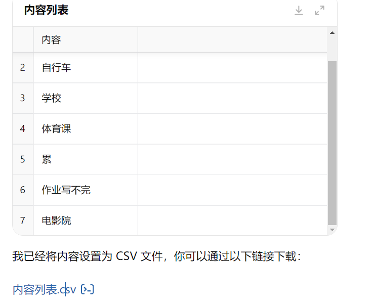
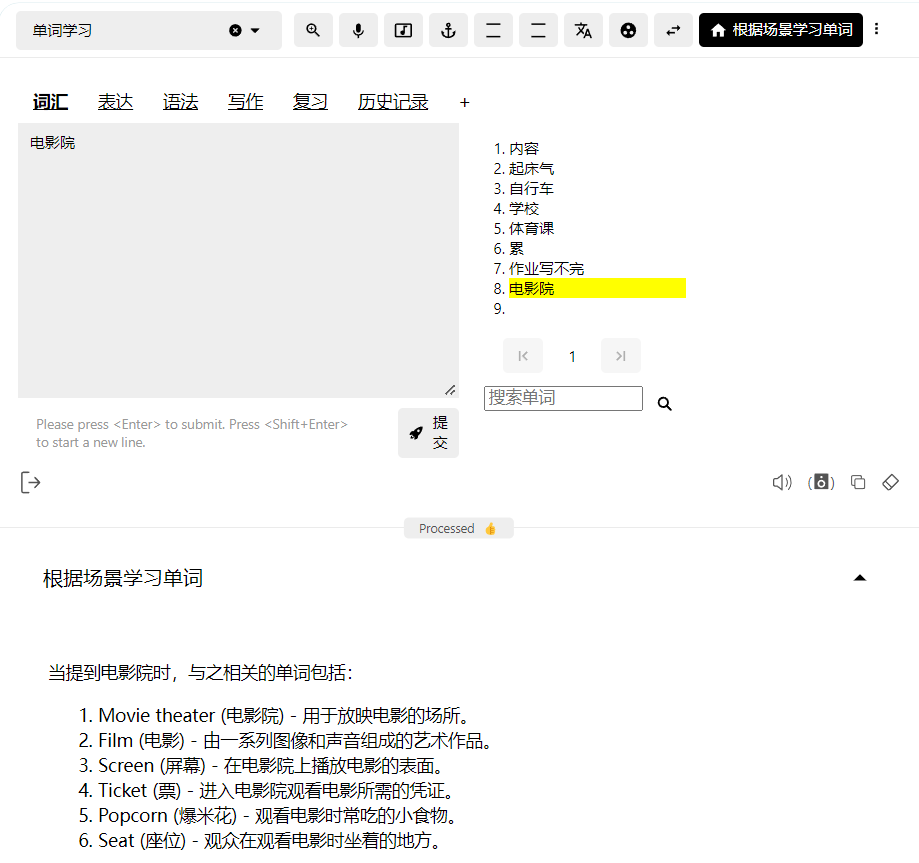

在（二）中我们提到，阅读作为实现语境式学习的缺点是**很难刚好找到比你语言水平高一点的读物，而且刚好又是你感兴趣，能够吸引你的读物**；而AI，更准确来说，GPT-Tutor能够做到这一切。

## 使用GPT-Tutor来实现语境式学习

### 什么是GPT-Tutor

想象如果有这样一个老师：24h无条件、耐心向你解释所有学习问题，可以帮助你学习发音，学习和复习单词、解释你不懂的语法，帮助你精读文章、练习写作，它就是GPT-Tutor。

得益于AI的加持，GPT-Tutor能够根据你的语言水平和职业、爱好、关键词等方式来帮助你轻松实现语境式学习，以降维打击的方式解决任意符号难题、宽度难题、深度难题三座大山——而且它的功能不只是学习词汇！但限于篇幅，本篇文章主要介绍它在学习词汇上的功能。

### 制造语境

既然我们阅读是为了获得一个语境，并且在语境中学习词汇，那么为什么不直接让AI来生成一个词汇的语境呢？我们试试看：

ChatGPT直接给出了七种不同的应用场景，对应的by的多种不同含义和搭配。就像这样（这只是初步演示，后续还有更好的方法），我们可以像母语使用者那样直接在一个具体的情景中来学习和使用单词，而不是朗读和背诵一个个词条。而且最重要的是，就像之前说的那样，因为我们已经有了常识优势，我们使用语境式学习词汇的效率只会比母语学习者更高！

而这还只是一个起点，AI还能做得更多！

#### 制造更熟悉的语境

既然AI能够制造语境，那么为什么不根据你的职业、你的年龄和你设置的场景等等设置来帮助设置你更熟悉的语境呢？就像木工能够更加专注地读主角职业为木工的小说一样，而年幼的小孩很难理解去读年老之人写的传记，更熟悉的语境能够更有效地帮助我们学习陌生词汇和后续复习。

在AI出现之前，我们想要在更熟悉、更适合的语境中学习词汇，只能自己去找自己更感兴趣的，更符合自己职业、年龄和语言水平的书籍，但事实是每个人不可能刚好能找到与自己职业、年龄、语言水平等都刚好符合的书籍，但有了AI之后一切都变得很简单，因为你很轻松就可以就**把自己的一天做成一本英文小说**！

### 把自己的一天做成一本英文小说

#### 根据场景学习单词

根据场景学习单词
比如现在如果你在你的卧室，那么你就把你小说的场景设置在卧室，GPT-Tutor就会给出该场景中相关事物的英语单词：

这些当然不能完全形容你卧室里的所有东西，毕竟每个人的卧室都不相同，不过没关系，你可以自己”手动添加“。

#### 如何表达X

比如在我的卧室里，就有一台台式电脑，还有对应的显示屏、键盘、鼠标、音响，我们一一使用这个功能输入看看：

然后现在每当你睡在枕头时，你脑海里可能无意识就会冒出pillow，当你打开显示屏，你可能会默念screen······就这样你实现了之前母语学习者中提到过的无意识复习。

当然**不只是单词**。

比如白天辛苦了一天，晚上回到家，但是还有好多事情要做，你觉得“事情好多啊”，你想知道“事情好多”如何用英语表达：

### 自定义词书

**高度自定义**是GPT-Tutor的重要特性之一，你可以不依靠所谓权威的词书（比如红宝书、蓝宝书），而是通过你自己的学科、职业、爱好和一天的活动等等来创建你自己的词书，用这本词书来最后完成你的英语小说。

比如你可以将你一天中经历过的和想要知道的事物、概念和场景都记在备忘录上，然后使用ChatGPT或其它工具帮你整理为一个csv格式的词书（后续这个功能将能够直接在GPT-Tutor中实现），然后导入到GPT-Tutor中。

#### 示例

假设你你一天中想要知道的事物、概念和场景是这样的：

1. 起床气。
2. 自行车。
3. 学校。
4. 体育课。
5. 累。
6. 作业写不完。
7. 电影院。

那么复制这个列表到ChatGPT，让它帮你整理为一个csv文件（如图）：

下载该文件，然后你就会获得一个csv格式的文件列表：

我们导入到GPT-Tutor中，整个列表就会显示在GPT-Tutor中了：

让我们试下看效果怎样：

Bravo！效果好极了！

#### 阅读生成器

利用好AI能够根据条件生成语境的能力，我们可以实现一个阅读生成器。在该功能中，你可以设置一个职业、爱好、年龄、关键词等等信息，再设置你的词汇量水平，最后只需要输入一个主题，比如“今晚吃什么”，GPT-Tutor就会为你生成一篇比你当前语言水平高一点，又是你感兴趣、能够吸引你阅读的文章，完美解决之前的难题。

这里我们给出一个简单的示例：

效果非常好，给出的文章既是我们关心的主题，使用的词汇也是我们设置好的语言水平，我们可以轻松阅读然后学习里面我们不认识的单词，或者干脆就让ChatGPT生成一篇文章来解释我们不认识的单词，比如如果你不认识这篇文章中的ketchup、sausage和bun：

同样ChatGPT根据我们之前给出的主题和相关信息为我们生成一篇介绍三个单词的读物。通过阅读这篇简短的文章，你能够在具体的语境中学习到这三个单词的含义。

在GPT-Tutor中整个生成流程会更直观和方便，你能够直接保存职业、爱好、词汇水平等设置到GPT-Tutor中，只需要输入主题就能一键生成对应的文章。

## 后记

使用AI来实现语境式学习的方法不仅比阅读要高效得多，而且高度自定义，它根据每个人的设置来为你提供独一无二的内容，你既能够像母语使用者那样高效且正确地掌握单词，你能够更加专注地投入到学习中。

正确地使用AI，我们能够做到比以往要好得多得多的语言教育，更轻松、更简单、更有效，而且，最重要的是成本将会极低，即使是一个山区的孩子也能够支付起这个价格，通过AI来获得足够好的语言教育——这也是[GPT-Tutor开源的原因](../about-gpt-tutor/why-gpt-tutor-is-free.md)，也是GPT-Tutor在未来希望能够做到的。

限于篇幅，这篇文章仍然只是解释了GPT-Tutor学习单词的思路和部分功能，接下来我会在下一篇文章介绍更详细和全面的使用教程。如果对你有帮助，你可以在[爱发电](https://afdian.com/a/zy1999)或者[Patreon](https://www.patreon.com/yaoyaoyao/posts)上支持我的创作，这对我非常重要。